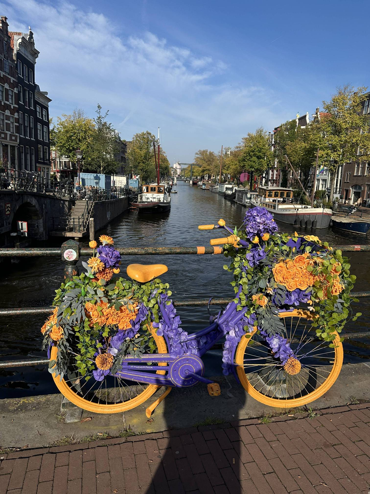

+++
author = "Sathyajith Bhat"
categories = ["Life"]
tags = ["weekly-notes", "gaming"]
places = ["Sydney", "Amsterdam"]
type = "post"
series = ["Weekly notes"]
url = "/weekly-notes-40-2025/"
title = "Weekly notes 40/2025"
date = 2025-10-05T12:00:00Z
summary = "Week 40 summary - vacation week in Amsterdam."
images = ["/weekly-notes-40-2025/thumb-amsterdam-cycle.jpg"]

+++

_Thumbnail image: These brightly coloured bikes are the handiwork of Warren, known fondly as the Flower Bike Man. Warren began bike-decorating began when his wife couldn’t find her bike at Amsterdam Central._

### What's been happening

Ah, a rare vacation week. Raylen’s wedding was over the [weekend](https://sathyabh.at/weekly-notes-39-2025/) and I had some free time to relax. While most people returned by Sunday, I had another 5 days to kill. I don’t know why I booked for a week though. I guess when I applied for Schengen visa, I had created a weeklong itinerary as it was supposed to be for tourism. And since the visa came through pretty late, I didn’t want to change it around.

I must admit on Sunday I was feeling incredibly guilty that I have a week-long vacation, especially since that Jo was back home and working. She, however, convinced me to enjoy and have fun in Amsterdam. So I did - I met a few folks from all walks of life - people from Chip forums, Digit forums, a chance meet with a friend I’d known from [hi5](https://en.wikipedia.org/wiki/Hi5) (remember that?). I had a wonderful time chatting with them all. And of course, through the week I also met Raylen several times, having a nice beer and some long conversations.

I also got an amazing tour of [Amsterdam Science Park](https://en.wikipedia.org/wiki/Amsterdam_Science_Park) and the [University of Amsterdam](https://en.wikipedia.org/wiki/University_of_Amsterdam) thanks to another friend. I’ll have a separate post on Amsterdam but many many steps were taken.



My flight back was okay. The return flight path was Amsterdam - Dubai - Sydney. The flight from Amsterdam to Dubai was on a Boeing 777-300ER and I thought it would be more cramped than the A380 but turns out it was quite similar. I actually played on my Steam Deck (playing some Hades 2 and Civilization VII) throughout the first leg - something which I have never tried before. It was pretty good. Having an in-seat power plug that accepted an Australian plug meant hat I didn’t need to add any fiddly socket adapters and I could play without any pain.

I was back in Sydney on Saturday evening. I unpacked my clothes, got a nice hot shower, had early dinner, played for a little bit and went to sleep early.

On Sunday, I went for a nice walk to Kirribilli lookout and was glad to be back at one of my favourite places. It’s really nice to sit down and just look at the Opera House. I stopped by BTB for a quick coffee/breakfast and spent the rest of the day doing some grocery shopping and laundry.



### What I've been playing

Hades II - Hades II was officially released last week, after being in early access for about a year. I had written some thoughts about Early Access [last year](https://mastodon.social/@Sathyabhat/112399555345611057), and I played a little bit more and slowly getting the hang of it. I’ll reserve my thoughts for now and will have a write up once I have played more.

### Music of the Week

“Trippin’ on You” is the first single from John Butler’s latest album, “Prism” and is a very catchy, upbeat song.



Highly recommend listening to the [entire album](https://open.spotify.com/album/7hs6LrNQDVwx1e0pwamcIZ) is it is simply marvelous.

### Link of the week

[Saow](https://www.youtube.com/@SaowAngel) has a great YouTube [video](https://www.youtube.com/watch?v=xe0lzIqrcYg) on Sydney’s popular tourist traps and I agree with every single one of the venues covered!



### Thanks for reading.

Thanks for reading and have a great week ahead.

Subscribe to my weekly notes:

- [Email newsletter](https://sathyabhat.substack.com/)
- [RSS feed for the weekly notes](https://sathyabh.at/series/weekly-notes/index.xml)
- [RSS feed for my site](https://sathyabh.at/index.xml)
