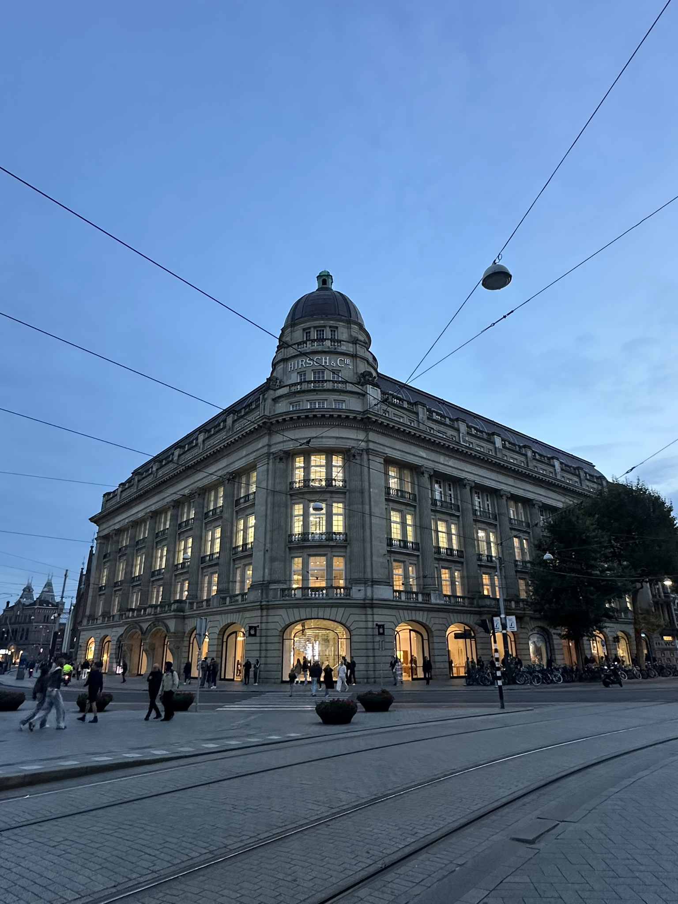

+++
author = "Sathyajith Bhat"
categories = ["Life"]
tags = ["weekly-notes", "gaming", "house-hunt"]
places = "Sydney"
type = "post"
series = ["Weekly notes"]
url = "/weekly-notes-42-2025/"
title = "Weekly notes 42/2025"
date = 2025-10-19T12:00:00Z
summary = "Week 42 summary - fire evacuation drill, Civilization 7 Persia campaign, and more."
images = ["/weekly-notes-42-2025/thumb-hirsch-building.jpg"]

+++

_Thumbnail image: The Hirsch Building was the flagship store of the clothing company Hirsch & Cie. Now it hosts many retail stores and since 2012 serves as the location of the first Apple Store opened in the Netherlands._

### What's been happening

Ah the weather's getting hotter. This week it felt like the oven temperature was cranked up a notch. Towards the end of the week we had a flash thunderstorm with some hail which cooled things down a bit but we're looking at mid 30s temperatures next week. The shorts are out, duvet covers changed, air circulators are… circulating. Only a matter of time before the aircon is running again. 

Midweek, we went for a house inspection. The house was pretty nice (small backyard) but very close to the metro as well as the town center and was the first house we felt like we should make an offer on. We talked to our mortgage broker, a conveyancer (a property lawyer), got the building and pest report which looked clean and we put the offer in, but we haven’t heard anything back. I’m assuming either it was rejected or they are waiting for this weekend’s inspection which would probably mean they’ll have people offering higher numbers (our number was less than what the agent told the owner was expecting but certainly didn’t lowball them). Ah well, such is life. I had been preparing for this since we started looking for a house. Well, since we haven’t heard anything we spent the Friday evening lining up a bunch of house inspections. This is our new routine now - not sure how long it’ll go on but can’t really do much. 

In other news - I’m back to my usual set of PT. I’m still doing volume (12 reps instead of the usual 8). I didn’t do my third session (group class) as we had to go for a house inspection but I do want to get back into the thrice a week routine. 

Work was okay. I had a bunch of compliance/auditing work that was pending due to my travel so I was busy with that. We've been working on improving cost attribution at work, and I realized our usual cost attribution steps had not been applied to an AWS account of a company that was acquired. I updated the tags for the auto scaling group but that would apply for new instances, not the existing ones. Since the instances were in the thousands, getting the instances, filtering the ones that didn't have the right tags and applying them would have been too much of a pain with a shell script (especially since we'd likely get throttled). So I fired up Cursor and asked it to write a Go app that will do exactly this. And in a minute, all of these instances were correctly tagged. This would have taken a few hours at least, with retries to handle all the edge cases, throttling and such, so I've definitely found good use of the LLMs. Apart from this, we also had a fire evacuation drill in the office. Unlike the [last time around](/weekly-notes-40-2023/), at least it was _only_ an eleven-storey climb down so didn't feel much.

Most of Saturday was spent on house inspections. We saw a really nice house with a great backyard which we really liked but there's no chance it will be in our budget. So for now, the house hunt continues.

### What I've been playing

Civilization 7 - I finished the Antiquity era with [Genghis Khan](https://civilization.2k.com/civ-vii/game-guide/leaders/genghis-khan/) of the [Persian](https://civilization.2k.com/civ-vii/game-guide/civilizations/persia/) Empire. True to his real life persona, I fully embraced his militaristic side, dispersing several independent powers (after they _rudely_ kept invading me). Towards the late Antiquity era, I had [Tecumseh](https://civilization.2k.com/civ-vii/game-guide/leaders/tecumseh/) who decided to go to war with me... and thus he did not last long. Persia's unique unit Immortal which heals for a set amount after defeating an enemy along with their reduced Military Unit maintenance and the unique commander, Hazarapatis, which gives a free promotion that allows units to move after unpacking from the Commander meant that dispatching Tecumseh was pretty easy. I ended the Antiquity era, heading into the Exploration era starting with [Mongolia](https://civilization.2k.com/civ-vii/game-guide/civilizations/mongolia/). I also liked that the new map generation created an interesting map that was not a block slab. 

                             

Diablo 4 - Season 10 has been progressing well. The Shred druid is pretty fun to play and incredibly fast. I can play with ease in Torment 3, but don't really have the defenses to go into the higher pit levels or Torment tiers. 

### What we ate

[Choice Indian Food, Quakers Hill](https://maps.app.goo.gl/nuzuh5Pw9icdiVLDA) - Small Indian vegetarian restaurant. We stopped by here for lunch during our house inspection. I wanted to go to the restaurant right next to this place, but Jo made an excellent point that given how _busy_ this place is and how empty the other restaurant is, this one might be better. Couldn't argue against that. We ordered roti, kadai paneer and samosa chaat. The roti and the kadai paneer were really good, we both enjoyed it. We ended up ordering an extra roti as well. The samosa chaat was so-so. Given it's Deepavali, they had a huge assortment of sweets on sale. It was really tempting but we decided to get one piece of sweet and split it in half.



### Music of the Week

Came across this really nice and catchy song called "Bright Blue Skies" by Mitch James. Just casually ignore the [lyrics](https://www.youtube.com/watch?v=JxG5REq6jdo) though lol. 



### Link of the week

I came across this nice thread on Hacker News - [Ask HN: Abandoned/dead projects you think died before their time and why?](https://news.ycombinator.com/item?id=45553132) and was gobsmacked by how many of the project names I knew/remember. Growing up in this period was certainly one of the coolest eras of tech.

### Thanks for reading.
Thanks for reading and have a great week ahead.

Subscribe to my weekly notes:
- [Email newsletter](https://sathyabhat.substack.com/)
- [RSS feed for the weekly notes](https://sathyabh.at/series/weekly-notes/index.xml)
- [RSS feed for my site](https://sathyabh.at/index.xml)
