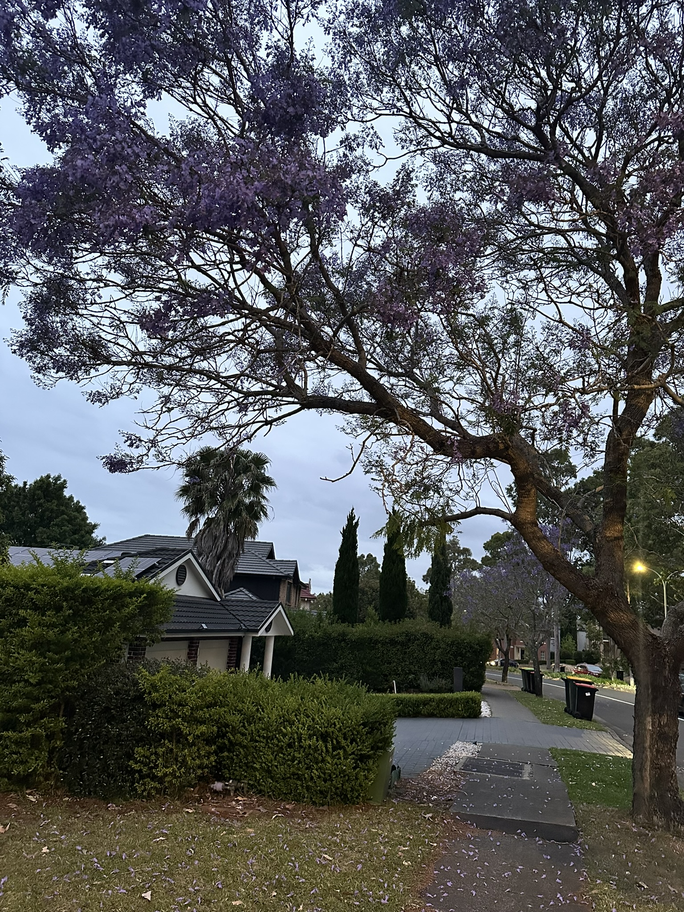

+++
author = "Sathyajith Bhat"
categories = ["Life"]
tags = ["weekly-notes", "gaming", "house-hunting"]
places = "Sydney"
type = "post"
series = ["Weekly notes"]
url = "/weekly-notes-43-2025/"
title = "Weekly notes 43/2025"
date = 2025-10-26T12:00:00Z
summary = "Week 43 summary - house auction experience, one year of weight training, and more."
images = ["/weekly-notes-43-2025/thumb-jacaranda-2025-1.jpg"]
+++

_Thumbnail image: Jacaranda season is here and the flowers are in full bloom._

### What's been happening



Things have been heating up, quite literally. We had two 39-degree days here in Sydney in the past week. Given we're only in late October, we're in for a pretty long and hot summer. During the week, we decided to take a second look at a house we'd been interested in. After seeing it again, we talked to our conveyancer, our mortgage broker and decided to go ahead with the purchase. The catch being, it's an auction and we had to be prepared for a competitive bidding process. We were also preparing for the fact that we might not get the winning bid so had to continue with our usual series of house inspections on Saturday. Thankfully on Saturday, it wasn't as hot as the previous days. We managed to get through all the inspections without much trouble.

Come Sunday morning, we had the auction. I'd always seen auctions on TV, but never attended one in person. Jo and I talked briefly about the auction process and what to expect. The auction experience was quite interesting. There was an open house half hour prior to the auction to get some last set of house inspections in as well as to register for the auction. We also had several onlookers, particularly neighbours joining in to see the auction. The auctioneer started the auction process with him giving a brief about himself and about the property. I think there were about 10 people looking to bid on the property. The first few minutes were quiet as people were looking at each other and trying to see who would bid first. I had the agent standing next to me and pointing out a number and asking me to go bid first. After a couple of times of him trying to encourage me to bid, I told him it's good, let the others start the bidding and the agent backed off.

Once the first bid came in, things started moving quickly. Bids were coming in think and fast and the numbers were going up rather quickly. Once the bidding numbers reached close to the minimum valuation mark, I started adding in couple of bids. With the other parties bidding in pretty fast, we reached our hard limit in a few bids and decided to stop bidding. Our hard limit was countered but we were out of action. There were no more bids after that and the property was sold to the highest bidder. Overall, it was an interesting experience and it was good to see how auctions work in real life. Post the auction, Jo & I looked at each other and we were a bit disappointed that we didn't get the property. However, we were also relieved that we didn't overpay for it. We'll keep looking for other properties and hopefully find one that we like.

While returning from the auction, we got down in Chatswood and decided to have brunch at a cafe there. 

This week also marks a [year of me starting strength](/weekly-notes-43-2024/) training. It's been a great year of strength training and I've seen significant improvements in my strength and overall fitness. I've seen notable changes to my resting heart rate, walking pace/walking heart rate, and of course I've lost about 18 kilos while significantly improving my body composition. To mark the one year milestone, my trainer also gave me a nice t-shirt! I look forward to continuing my strength training journey and seeing more improvements in the coming year. 



### What I've been playing

Diablo 4 - Season 10 has been progressing well. I can now play in Torment 4, and now there's no incentive to keep playing it. I'll stop playing the season and go back to Path of Exile 2 for a couple of days as the new league of Path of Exile starts next week and I want to try playing Path of Exile again. 

Civilization 7 - The Genghis Khan campaign continues! I played a few more turns, taking on Jose Rizal and took over the capital. I then waged another war against them to take over two of his cities so that I can start sending the treasure ships over so I can get some progress on the economic victory front. 



### What we ate

[Laung Lachee, Quakers Hill](https://maps.app.goo.gl/ygwn1CGCx8UsvkZg7) - We stopped by here for lunch during our house inspection. Laung Lachee is an Indian restaurant. We were short of time so we ordered two non-veg thalis. The thali came with rice, naan, butter chicken, lamb rogan josh and channa masala. The food was really good and we had a great lunch here. Definitely coming back here again if we're in the area.



[Flower Child Cafe, Chatswood](https://maps.app.goo.gl/VmgaLkQ8DVJPfnDj8) - We stopped by here for brunch after the auction. The cafe has a nice floral theme and is quite cozy. We ordered the scrambled eggs for Jo and the prawn linguine for myself. I really wanted something sweet but the Tiramisu pancake / french toast looked too sweet so I decided against it. We also ordered a couple of iced mochas to go along with our meal. The scrambled eggs were really good, nice and creamy. The prawn linguine was also quite good, the prawns were fresh and the sauce was flavorful. They mentioned the prawns would be spicy - it wasn't really but was grilled well. Overall, we had a nice brunch here and would definitely come back again.



### Music of the Week

More known for their song "Run around", I came across "[But Anyway](https://www.youtube.com/watch?v=XjYGpTkoRVw)" by Blues Traveler. A nice upbeat song with great harmonica work and some killer guitar riffs.



### Link of the week

Building Beautifully are doing a train race in Sydney along the style of [Jet Lag: The Game](https://en.wikipedia.org/wiki/Jet_Lag:_The_Game). I look forward to see this video when it comes out! 



### Thanks for reading.

Thanks for reading and have a great week ahead.

Subscribe to my weekly notes:

- [Email newsletter](https://sathyabhat.substack.com/)
- [RSS feed for the weekly notes](https://sathyabh.at/series/weekly-notes/index.xml)
- [RSS feed for my site](https://sathyabh.at/index.xml)
