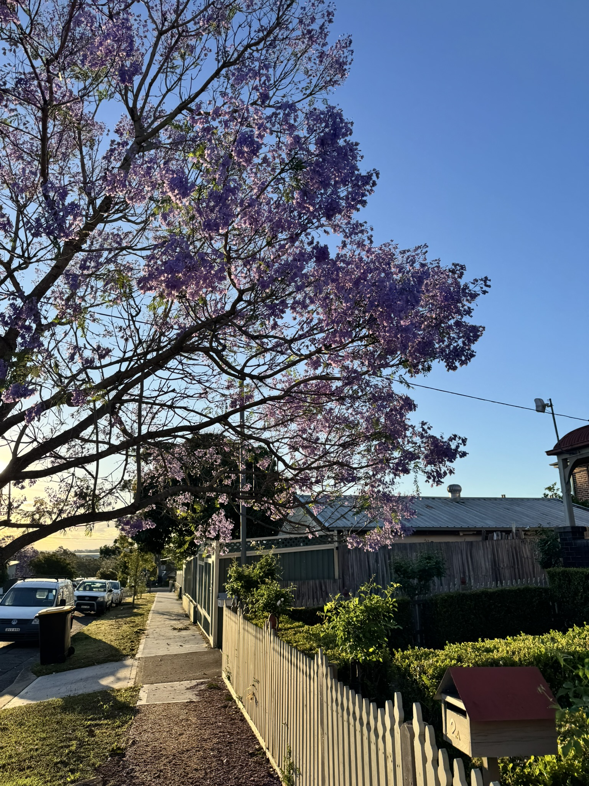

+++
author = "Sathyajith Bhat"
categories = ["Life"]
tags = ["weekly-notes", "gaming", "house-hunt"]
places = "Sydney"
type = "post"
series = ["Weekly notes"]
url = "/weekly-notes-45-2025/"
title = "Weekly notes 45/2025"
date = 2025-11-09T12:00:00Z
summary = "Week 45 summary - Spring weather, house hunting continues, workouts and good food"
images = ["/weekly-notes-45-2025/thumb-jacaranda-251109.jpg"]

+++

_Thumbnail image: More sights of pretty jacaranda in bloom across Sydney._

### What's been happening

Spring (or is it summer?) is in full swing here in Sydney. The weather has been lovely, with plenty of sunshine and mild temperatures (and the occasional set oven to full roast mode on a day or two). As much as I'd like to take advantage of the nice weather, most of the weekend has been devoted to house inspections like the past couple of weekends.

After last weekend's misery of Jo dropping the iPad on [her foot](/weekly-notes-44-2025/), this weekend was thankfully uneventful. Her foot is healing well, and she's back to walking normally. It's still not quite 100% and there's still some bruising visible but it's getting better each day.

Mid-week, I managed to catch up with [Lakshan](https://laktek.com/) for lunch. We had originally planned to meet last Wednesday, but I had to reschedule since my team was having a lunch outing. As with a lot of my connections, I know of Lakshan via Twitter. I can't remember when or how I first followed, it must have been early twitter days. Looking at my DMs with him, I also realized Lakshan had given me a warm welcome message when I moved to Sydney and offered to meet over coffee - which I completely forgot about until I saw it again. Oops. Sorry mate 😅 We had a great chat over lunch, talking about tech, life in Sydney, and all things here and there. Definitely looking forward to more such meetups in the future.

This week, I also managed to get a third workout session in (a group class on Wednesday). While my PT sessions continued as always, I hadn't gone back in for the group classes since the Amsterdam trip. It was good to be back in the class, even though I felt the effects of the class. The group class featured equal emphasis on strength training (Romanian deadlifts) and metcon. In particular, the metcon was 2 rounds of rowing (650 meters), run (skipped in favour of cycling), cycling (10+10+10 calories) and single/double unders (which I skipped since I can't do them). It was a good challenge - in particular trying to sustain the rowing and cycling efforts to cover the calories/distance - it's easy to start too fast and burn out early. By the end of the class, I was pretty exhausted but it felt good to push myself. And of course, my hamstrings were definitely feeling it the next few days.

Saturdays featured our usual set of house inspections. In between the house inspections, one of the houses that caught our eye was going on auction so we decided to observe the auction (we felt it would be beyond our budget so didn't register). After [last auction where we got outbid](/weekly-notes-43-2025/) and was over pretty fast, this was one was in the completely opposite direction, which I must admit surprised both Jo and I. This auction had four, maybe five bidders and apparently no one was interested in going above the starting bid itself. The auctioneer tried to get some bids in and a person put in a bid for a lot lesser than what the auctioneer wanted to get started with. With no takers, the auctioneer gets a vendor bid in (house sellers setting the bid). To the vendor bid, a person made a marginally higher bid, but no one were interested in bidding at that range and thus ultimately, the auction not having met the reserve price got officially passed on.

### What I've been playing

Path of Exile - Keepers of the Flame league: In the few hours that I've been able to get, I tried to progress a bit further into the league. I've never completed the campaign so for now I'm still playing through the campaign and about halfway in. I've been playing a Witch (Elementalist ascendency). The build I'm playing is a lightning conduit Elementalist - shock all enemies around and zap 'em. The gameplay is very satisfying, fairly engaging and not just a walking simulator.

Civilization VII - Civilization VII came out with a new patch that greatly improves naval units and resources, and also adds a new leader - [Blackbeard!](https://en.wikipedia.org/wiki/Blackbeard). I didn't get a chance to try it out yet but will give it a try soon!

### What we ate

[Himalaya, Bella Vista](https://maps.app.goo.gl/gQHHkppq5dZQnWrs7) - We stopped by here when doing our usual house inspections. Himalaya is a restaurant focusing on Indian/Pakistani dishes. We ordered the lamb seekh kebab, tandoori roti and Lahori chicken. The food was really well done. The seekh came on one of those iron _sizzler_ plates full of smoke and flavour and a bit of showmanship. The rotis were great, and the Lahori chicken was stellar with good quantity. We ended up taking home the Lahori chicken that was too much to finish off. Highly recommended place and definitely a place to revisit. They also have _ifthar buffets_ which would be good to try out.



[Mr Hotpoter, Chatswood](https://maps.app.goo.gl/kw1owG6THWqPAjEB9) - Jo had been meaning to go to a hotpot for a while now and last weekend was when we finally decided to the go to Mr Hotpoter. This restaurant is like a mix of a hotpot and sushi train restaurant - you order your hotpot base and then a conveyer belt keeps rolling around various ingredients that you can cook in the base. We had a variety of veggies, meats and loved it. Worth a visit!



### Music of the Week

[John Butler's Hand In Mine](https://www.youtube.com/watch?v=UI-PEPB7wKc) from his PRISM album is another wonderful song. I've mentioned previously but PRISM is one of those rare albums which you can listen and just melt away.



### Link of the week

[Preshit links](https://nuclearbits.com/remembering-in-focus-the-atlantic-photo-blog-alan-taylor/) to a fabulous [Photo Blog](https://www.theatlantic.com/photo/2012/11/diwali-the-festival-of-lights/100404/) from about a decade-and-half or so ago covering some amazing photos of Diwali.

### Thanks for reading.

Thanks for reading and have a great week ahead.

Subscribe to my weekly notes:

- [Email newsletter](https://sathyabhat.substack.com/)
- [RSS feed for the weekly notes](https://sathyabh.at/series/weekly-notes/index.xml)
- [RSS feed for my site](https://sathyabh.at/index.xml)
