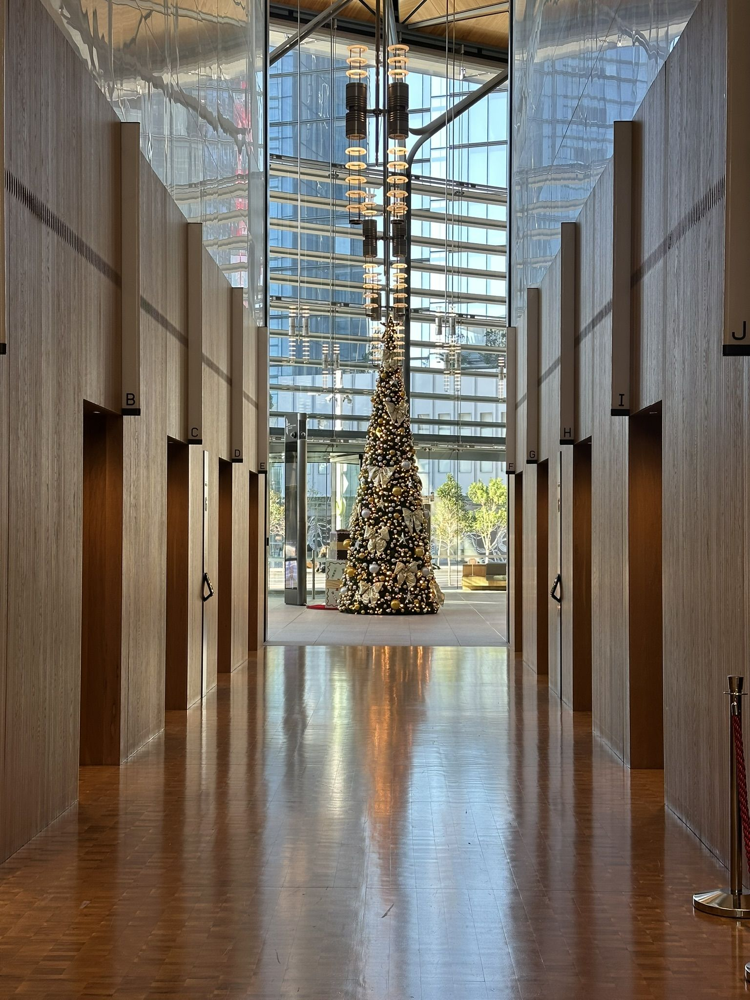

+++
author = "Sathyajith Bhat"
categories = ["Life"]
tags = ["weekly-notes", "gaming", "house-hunt"]
places = "Sydney"
type = "post"
series = ["Weekly notes"]
url = "/weekly-notes-47-2025/"
title = "Weekly notes 47/2025"
date = 2025-11-22T12:00:00Z
summary = "Week 47 summary - a visit to the emergency room, Christmas vacation plans and more."
images = ["/weekly-notes-47-2025/thumb-barangaroo-christmas-tree-2025.jpg"]

+++

_Thumbnail image: More Christmas trees coming up - this one from my office at The International Towers, Barangaroo._

### What's been happening

Ah, another week of new stuff and things that I didn't expect. At the start of the week, we formally signed the loan contract for our [new house](/weekly-notes-46-2025/). Once we got the loan signed, we forwarded the documents to our solicitor to get the settlement process started. We've also bought home & contents insurance. The settlement date is set for mid-January, so we have some time before we get started. We should get started with packing up our current house and while at it - giving away the things we don't need - particularly clothes. Over the past year, because of our workouts and diet changes, both of us have lost a lot of weight and our clothes don't fit us anymore. So we are going through our wardrobes and giving away the clothes that don't fit us anymore. 

Jo's been busy scouring the Internet for design ideas for the new house. I've also been thinking about what to do with my office space in the new house. I've been thinking of getting a corner desk setup so that I can have more space for my monitors and other stuff. Anyway, that's for later. For now, we will most likely just move our current furniture to the new house. The new house doesn't have a dryer, so Jo went over to Ikea to get some extra sheets, blankets and pillow covers since we won't be able to dry them in the dryer. Earlier in the year, we had enrolled our apartment in the CSIRO [Apartment Energy Study](https://ahd.csiro.au/aebs/) and we just got access to the portal that gives us the data from the temperature and humidity sensors. The data was quite interesting and since the study is for apartment energy use, the sensors will have to be returned to CSIRO. I bought a few temperature and humidity sensors from Aliexpress so I can continue to have the data. These should be arriving next week and I look forward to experimenting with them.

I also had the unfortunate experience of having to go to an Emergency Room (ER/ED) in a hospital. This started around Thursday midday when I felt a light niggle in my right hip and could feel I was limping (even more than usual). By Thursday night this became quite prominent to the extent that I couldn't sit anymore so I decided to go sleep. That's when I realized how bad it was - I could barely stretch my leg and I had a torrid night with me barely sleeping. The next morning it didn't get better. I tried to get an appointment with my GP but there were no slots available. With the pain not getting better and my worry that it might be a recurrence of the old back issue, Jo suggested we head over to the ER. We also called our brother-in-law in Brisbane who said it's unlikely to be related to the old back issue but suggested we head over to the ER anyway. 

The closest ER was in the Royal North Shore Hospital in St. Leonards, so we took an Uber there. Once at the room, first we got a token to wait while the triage nurses took a first look. We waited for about 10 or so minutes before the triage nurse called me in, asked briefly about what's happening, any history etc. They sent us into the waiting lounge where we sat for a few hours. Jo and I had heard of long waiting times in the ER so we were sufficiently prepared with battery packs. A doctor then came over, called me over to the examination room, asked about what led to me being at the hospital. He did some strength tests, asked about the kind of pain I was experiencing and then gave me the good news - it's just a strain. I got an X-Ray done just to verify things and the X-ray showed there was no bony injury and I was free to go - just take it easy and apply ice and take an ibuprofen if required. It's been a day since and I've almost recovered. I'm still walking around with a slight limp but there's no muscle pain anymore and I can stretch my legs properly. This incident had me worried slightly but I'm happy to get back to regular stuff!

Apart from this, we also booked tickets to Brisbane to meet Jo's sister and her husband (the person whom we had called) so we can spend some family time this Christmas.

### What I've been playing

Path of Exile - I finally completed the campaign of Path of Exile (took about 18 hours) and it's a pretty ok run. The campaign starts pretty well but then things get lost in between and next thing you know, you're back in the same place as you were in the previous acts, just killing gods... for weird reasons. Anyway you don't play ARPGs for story, you play them for the progression, the loot and the feedback cycle of kill enemies - gain experience - get better skills/gear - farm stronger content and Path of Exile, with the insane amount of [league mechanics that have been](https://www.poewiki.net/wiki/League_mechanics) added over the lifetime of the game, still keeps things quite grounded and lets you focus on mechanics that interest you and skip what is not so great. It's been good to complete the campaign (only been trying to do it since the past decade), now I will look forward to mapping. Path of Exile 2's new league features a new class (Druid) that I'm looking forward to trying so it gives me enough time to experience some more Path of Exile.

### Music of the Week

I came across this [awesome chillout remix](https://www.youtube.com/watch?v=OUrlPm9kW5g) of The Doors' "Riders on the Storm" that is so incredibly well done. 



### Link of the week

Josh Goes Slow takes a [train](https://www.youtube.com/watch?v=E0Cck2DALOs) (one of the newer Mariyung fleets that [we got to try](/weekly-notes-31-2025/) when we were trying to return from Hunter Valley) to Newcastle and explores it on foot. We had a nice time in Newcastle when we [visited a couple of years ago](/2023/03/20/weekly-notes-11-2023/) - definitely should plan to visit again.



### Thanks for reading.

Thanks for reading and have a great week ahead.

Subscribe to my weekly notes:

- [Email newsletter](https://sathyabhat.substack.com/)
- [RSS feed for the weekly notes](https://sathyabh.at/series/weekly-notes/index.xml)
- [RSS feed for my site](https://sathyabh.at/index.xml)
