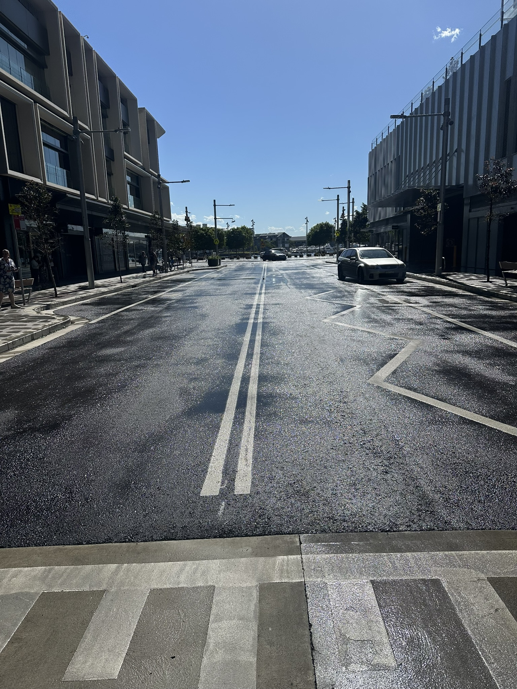

+++
author = "Sathyajith Bhat"
categories = ["Life"]
tags = ["weekly-notes", "gaming"]
places = "Sydney"
type = "post"
series = ["Weekly notes"]
url = "/weekly-notes-48-2025/"
title = "Weekly notes 48/2025"
date = 2025-11-30T12:00:00Z
summary = "Week 48 summary - weather swings, final concert of the year, and more."
images = ["/weekly-notes-48-2025/thumb-barangaroo-syndey-rain.jpg"]

+++

_Thumbnail image: Barangaroo showing some signs of the rains that I was talking about._

### What's been happening

It's been an interesting week. Sydney weather has been all over the place. It started off pretty hot, turned cloudy at one point, and towards the end of the week it was very windy. It was also concert week - our last concert of the year. I had a spare ticket because I was not supposed to be here in Australia - I had planned to go back to Mangalore for a family wedding and from there head to Las Vegas for AWS re:Invent. I ended up cancelling the trips because we started looking for our house. 

That meant that I had only one ticket, which was actually Jo's ticket. We found a couple of tickets for the AC/DC concert on Tixel, and I listed the one ticket I had bought for Jo. On the day of the concert, Balu pinged me to meet as we were heading to Accor Stadium which is close to his house. As I was heading towards Olympic Park on the Sydney trains, I asked him if he wanted to join us for the concert, and he was pretty happy to get the ticket. So we ended up meeting for an early dinner. He took us to this Greek place which was pretty nice; they had some interesting lamb and chicken rolls that were very nicely done. From there, we went to Accor Stadium. The concert was pretty good. Before AC/DC took to the stage, there were a couple of support acts.
1. Large Mirage - a 70s rock/classic rock/retro rock band from Sydney. They had some really nice, interesting tunes and I really enjoyed their music.
2. Amyl and the Sniffers - a pretty well-known punk rock/pub rock band. Personally, I didn't quite enjoy them as much as I did Large Mirage. The concert audio mix didn't help their cause either. 

The final act, of course, was AC/DC. In the meantime, I was chatting with Balu on WhatsApp and I had sent him the set list. After a couple of songs, he said they were following the exact set list, and I realised I shouldn't have spoiled the surprise. It was a really loud concert, probably not as loud as Melbourne but loud nonetheless. The crowd was pretty good, and I was very surprised to see Angus Young in his 70s still doing the duck walk. It's hard enough for me to hop along on one leg now, imagine doing that when you're playing a guitar.



Apart from that, the week was pretty okay. I went to our usual PT sessions starting with a joint PD session with Jo on Monday, and then my Friday PT session was advanced by a few hours. Friday being a holiday for the US meant that I could take it during my usual morning meeting times as the morning meetings got cancelled. The PT session was good. Coming in from [last week's slight injury scare](/weekly-notes-47-2025/) where I had trouble walking, I was feeling much much better. My trainer took the sessions a bit easy. He was trying to ensure that I don't strain myself again and he was trying to understand why I got the injury in the first place. So he got me to do a couple of different variations of some mobility movements that I've been doing to figure it out. Through the course of these different movements, we realised that my glutes are actually a lot weaker than he thought they should be. I couldn't properly do a hip thrust when I was seated on the floor. So I'll probably be working a lot on the glutes through the next couple of weeks and also try to improve my core strength quite a bit. He also owed me a couple of extra classes because we missed some sessions, so I booked an extra class for Saturday morning at 8 o'clock.

It's also been our milestone week as Jo and I celebrated our anniversary. We are not big on anniversaries or any other sort of celebration, so we usually end up just going for dinner. We've always been meaning to go to this restaurant Antica. It opened about 2 years ago, and we pass by it every day. Nearly every time we do, we mention we need to have dinner there but never end up going. Jo felt like having renkon chips so we decided to go to Sakura. I just sat with Jo for a while as she was watching The Family Man and I was trying to do something on my laptop. 



On the home front, our settlement day has been finalized. I've scheduled my electricity and gas move. We will have to book our movers as well.

Umesh had invited us for dinner at his place on Saturday, so we went over to Parramatta on Saturday evening. Balu joined in as well. I enjoyed the evening with them and it was good to catch up. We had some really good Mallu food - pazham pori, biriyani, parotta, the staple Mallu meat dishes and fries. The return train journey was supposed to be straightforward, but halfway through the trip the train was delayed by about 10 minutes because a weird lady brought an entire shopping cart filled with groceries into the train and refused to take it out. After some commotion and a lot of heat from the passengers, she still refused to budge. The delay would have had cascading effects, so our train started to move, giving her some sort of victory. So annoying. Anyway we got back home and went to sleep.



Our Sunday morning started with a nice quiet walk over to Kirribilli Point and back, with the rest of the day spent relaxing.



### What I've been playing

Path of Exile - I continued playing Path of Exile, the Keeper's League. I'm just slowly playing along, getting closer to the endgame right now in maps. I'm still in early maps in the sense that I have not been able to progress much. One of the problems I've had with Path of Exile is that I'm still trying to figure out what is killing my character because it's like I get one-shot out of nowhere. My resistances are over the cap, and my spell suppression is reasonably high. But as I go into higher tiers, specifically at tier 6 and above, I keep getting one-shot, and I haven't quite figured out what is actually killing me. I'm not too fussed on getting to T16, though. I'm pretty happy with where I am, and with the next season of Path of Exile 2 starting next week, I think I'm gonna just wrap up this league of Path of Exile. I actually enjoyed playing Path of Exile more than I thought I would. Definitely gonna play more of it in the next league now that I can try to run through the campaign.

Path of Exile is still quite an overwhelming game for someone who's coming in new. It's got a decade-plus of additional content being added, many of which are being incorporated into the core game, so it's like you get hit in the face with a lot of different mechanics that are available. Because I've already played Path of Exile, those mechanics are a little bit more familiar to me since Path of Exile 2 includes versions of them that are just done better. But yeah, I'll have to figure out what character I'm gonna play (what class I will have to play) for Path of Exile for the next league, but that's like 4 months away, so we'll figure it out later. 

Roadcraft - Aman and I returned to play Roadcraft after a break of a few months - with Aman traveling and me occupied with the house hunt, we couldn't get any time to play at all. It was good to return to the game. We managed to complete a small mission to drain out some water and build a bridge which should make subsequent sessions a lot better. I couldn't play for long but we should be back to regular sessions.

### What we ate

[3NF Coffee](https://maps.app.goo.gl/QRaqCY13vS3THRjb8) Jo suggested we go to this coffee shop. We went there after my morning gym session. I had my usual large Cappuccino, while Jo had a chai latte. We also had some food. I ordered the big breaky plate, and Jo ordered the corn fritters. The food was actually pretty nice. Jo's corn fritters were pretty good and had a really nice heat to them. Mine was fairly average, it was like a big plate of poached eggs, baked beans, mushrooms, hash browns, bacon, and some salad with some supposedly sourdough which was not actually sourdough. The coffees were pretty good. Jo really loved her chai latte. I asked her why she went for a chai latte at a coffee shop, and she said, "When you go to a coffee shop which has milk-based teas, they usually tend to be good." This one did not disappoint. Overall, it was a good place to visit, and we would probably revisit again because I really wanted to try the breakfast burger which had the same chilli jam that was on her plate.



[Oski, Kirribilli](https://maps.app.goo.gl/zaH17A1v6PGvbCP66) While returning from our morning walk to Kirribilli, we came across this small cafe run and decided to check it out. Oski is easy to miss next to the larger cafe next door but is an amazing place seeming run by the owner who was single-handedly doing everything. During our course of stay, there were a few people who dropped by and he was greeting them by their first name, which is a great to see how much people like to return and how well he treats his return customers. We ordered our usual coffees and for food, I had a "pyttipanna" which is a Swedish dish consisting of chopped meat, potatoes and onions fried in a pan. Not sure how or why he was inspired to have that on the menu but it was really good. Jo had the chilli eggs which were scrambled eggs with chilli jam and it was really good as well. Really worth revisiting.



### Music of the Week

NPR hosts Goo Goo Dolls for a Tiny Desk Concert and it sounds so good. Was great to listen to them in an unplugged session.



### Link of the week

Sharath from Building Beautifully has a great video on what makes [Sydney Public Transport](https://www.youtube.com/watch?v=yc_WlS928q4) so good.



### Thanks for reading.

Thanks for reading and have a great week ahead.

Subscribe to my weekly notes:

- [Email newsletter](https://sathyabhat.substack.com/)
- [RSS feed for the weekly notes](https://sathyabh.at/series/weekly-notes/index.xml)
- [RSS feed for my site](https://sathyabh.at/index.xml)
