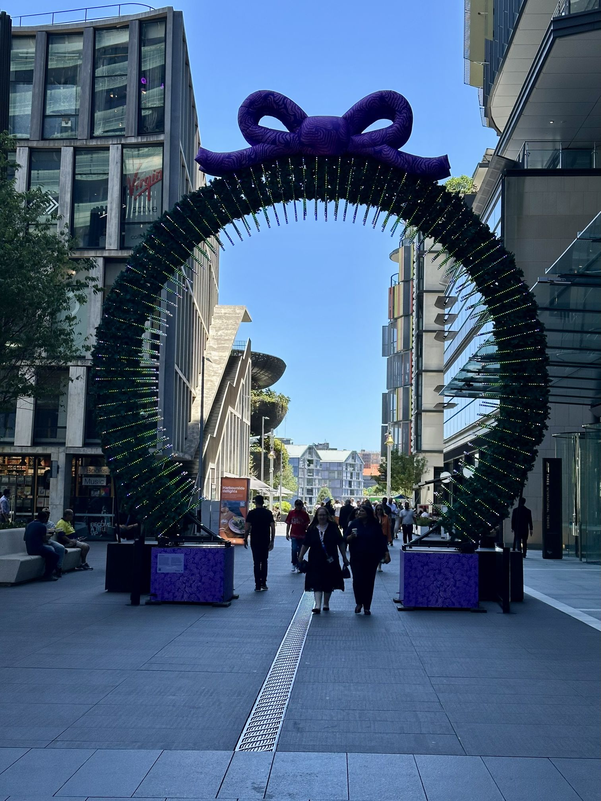

+++
author = "Sathyajith Bhat"
categories = ["Life"]
tags = ["weekly-notes", "gaming"]
places = "Sydney"
type = "post"
series = ["Weekly notes"]
url = "/weekly-notes-49-2025/"
title = "Weekly notes 49/2025"
date = 2025-12-07T12:00:00Z
summary = "Week 49 summary - heatwave in Sydney, a new game and more."
images = ["/weekly-notes-49-2025/thumb-christmas-decoration-barangaroo.jpg"]

+++

_Thumbnail image: Christmas decoration and wreath at the International Towers, Barangaroo._

### What's been happening

This week has been pretty hot compared to last week. Towards the end of the week we had a heatwave and an extreme fire warning. While most of the week the temperatures were in the high twenties, on Friday and Saturday it was closer to 40 degrees Celsius. Saturday morning we went for a walk, knowing that it was going to be pretty hot, but we just wanted to get some steps in. So we decided to go for a relatively short, early morning walk just before it got too hot. We stopped by the North Spoon for brunch and then came back home. 

The rest of the week was pretty okay. Workwise, I'd been preparing for the next week. A few of my teammates are coming down from the US for a meetup. We'll be focusing on next year's roadmap - what we are going to do, what we would like to do, and a little retrospective on what we did as well.

On the gym front, everything is okay. I'm still not quite recovered from my hip injury. While it's not sore, I still can't use all of my strength, so I'm working on improving it. This week, I managed to do glute bridges with a barbell across my hips, so that's a good sign. I also got Jo to come in for our weekly class on Wednesday. Wednesday's session usually focuses a little bit more on Metcon and aerobics rather than on strength training. Most of the classes are pretty high focus on the strength training side of things. Jo did pretty well for her second class - I always believed that she could do the classes, especially with all the training that she has been working on, and I'm happy to see her get that confidence. 

For next week, because we have our team meetup and office Christmas party, we'll move things around a little bit. The week after, we'll be in Brisbane for Christmas and will have to reschedule those classes as well.

### What I've been playing

For a change, I actually did not play any aRPGs this week. With the new season of Path of Exile 2 starting next week, I didn't feel like I wanted to get into Path of Exile 1 or 2. So I tried something else. I've been hearing a lot about Ball X Pit, and my friends also told me to go check it out. It's been at the back of my mind, so I was excited to finally try it. It's a lot of fun. Ball X Pit is a game that's like a mix of [Arkanoid](https://en.wikipedia.org/wiki/Arkanoid) if you remember the old game which is the block breaker style combined with Vampire Survivor style roguelite.

The basic principle is that you kill monsters by launching balls with your character. And, of course, each of these characters has special powers like freeze, fire, iron balls, bleed, etc. Then you can combine these balls to gain more power, or you can evolve these balls to get special abilities. Gameplay-wise, you launch balls and clear out the level until you reach the end of the level where you get into a boss fight, and there are different tiers of boss fights. Each round is pretty fast when you're starting off; it takes maybe 5 minutes before you fail. Each failed run improves your strength and your character, letting you go a little bit further into the game. I just finished the first level and cleared the boss which was a lot of fun. I've spent about 4 hours on it already which is quite a bit, considering that I've been playing an hour a day. 

There is also a special metagame similar to base-building. You can build farms, forests, quarries, and you can also build buildings which unlock new characters or give boosts to your stats. Much like the main game, the metagame has you building structures or harvesting resources by bouncing your characters off these buildings. You start off with a small square and then expand your town, which lets you build more buildings. There's a little bit of strategic depth into it in terms of where you place your buildings and resources. Highly recommended to go and check it out if you are interested in these kinds of games. It's not very expensive and good value for money. The music is really good and very engaging, and the sounds are also pretty amazing. Well worth giving a try. 

Apart from that, I also tried to go back into Factorio. I created a new save and quickly got very overwhelmed with it. I tried to watch some tutorial videos but they didn't help. I started using Nilaus' base-in-a-box blueprint and am using it as a crutch for now.

And of course, Grinding Gear Games announced the new league of Path of Exile 2 with a new Druid character class. The Druids can shape-shift into bears, wolves, as well as, interestingly enough, a wyvern. I don't know if I'll play the druid on launch. I might consider the monk using the unarmed monk build, but that starts next week. See how it goes.

### What we ate

[The North Spoon, McMahons Point](https://maps.app.goo.gl/N57VwXZnQ72Fzdws6) We went to this cafe on Saturday morning. We'd been [here before](/weekly-notes-20-2025/) and they've had some really good specials, so we went over to try them. Unlike the last time, it wasn't as crowded so we got a seat pretty fast. We didn't have to wait for long for the waiter to come and get our order as well.

For our food we ordered the focaccia with porchetta and a chicken bagel along with our usual set of coffees - cappuccino for me and almond latte for Jo. The coffee was as good as last time. The porchetta had a nice kick to it thanks to the spicy chili mayo that came with it. The bagel looked pretty ordinary. However, when I had a bite, it was pretty good.

We also had the orange & poppy cake which we ordered last time around and, same as last time, it was very good.



### Music of the Week

I first heard this song played live during their support act at the AC/DC concert. [Large Mirage's Miss Okay](https://www.youtube.com/watch?v=7xOxWUqiry4) is a banger of a track that reminds you of what '70s rock is about. 



### Link of the week

It's a Linus^2 collab - [Linus Tech Tips builds](https://www.youtube.com/watch?v=mfv0V1SxbNA) a perfect PC for Linus Torvalds, and Linus Torvalds gives a glimpse into his projects. Really cool collab video.



### Thanks for reading.

Thanks for reading and have a great week ahead.

Subscribe to my weekly notes:

- [Email newsletter](https://sathyabhat.substack.com/)
- [RSS feed for the weekly notes](https://sathyabh.at/series/weekly-notes/index.xml)
- [RSS feed for my site](https://sathyabh.at/index.xml)
