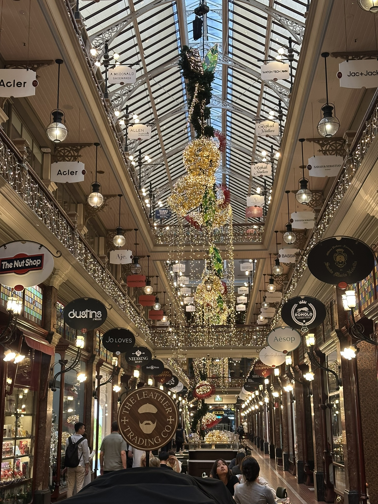

+++
author = "Sathyajith Bhat"
categories = ["Life"]
tags = ["weekly-notes", "gaming"]
places = "Sydney"
type = "post"
series = ["Weekly notes"]
url = "/weekly-notes-50-2025/"
title = "Weekly notes 50/2025"
date = 2025-12-13T12:00:00Z
summary = "Week 50 summary - work meetup, Christmas party and more."
images = ["/weekly-notes-50-2025/thumb-strand-arcade.jpg"]
+++

_Thumbnail image: The Strand Arcade is a heritage-listed Victorian-style retail arcade located at Pitt Street in the heart of Sydney._

### What's been happening

The week started pretty well. I was in the office for most of the week - I had my product manager and lead fly in from the US for our 2025 retrospective and planning for what we’d like to do in the new year. We had a lot of discussions on what we’d like to do and came up with a rough roadmap of things we’ll be doing and when to slot them in. On Thursday, we had our office Christmas party. The party was two-fold - first was a two-hour boat ride into the harbour and then move the party to Botanical House in Royal Botanical Garden. 

With my seasickness and [my last year's bad experience](/weekly-notes-35-2024/), I decided to skip the boat completely and head straight to Botanical House. I had some nice conversations with a few of my colleagues, witnessed a fantastic dance battle and slipped out just as the music was getting too loud.

On Saturday, I had promised Jo we could watch the light show at [Christmas at The Cathedral](https://christmasatthecathedral.org.au/) event at the St Mary’s Cathedral near Hyde Park, like what we did [last year](/weekly-notes-26-2024/). We took the Metro and went into the city. Before we went over to the Cathedral, we walked by Pitt Street, checking out the Strand Arcade and had dinner. Post dinner, when we were about to walk over to the Cathedral, Jo realized the event doesn't start till Dec 17th, so no light show. We ended up walking over to Martin Place to watch the Martin Place Christmas Tree and head back home. 



### What I've been playing

BALL x PIT - Been semi-obsessed with this game. I've been playing this whenever I can, even getting the Steam Deck out which I usually reserve for my travel. BALL x PIT's quick runs make it very easy to run a session whenever there's some free time available. I've unlocked a few new characters and two new levels, so the next would be to keep unlocking more characters, build more buildings and harvest more resources.

Factorio - I also made some decent progress into Factorio. I found some new patches of coal and expanded my belts to the new iron ore patch so the ores can be transported back. I also fixed my copper & iron ore smelting areas, and added a new green science building section. There's still more to do but it's coming along fine.

Path of Exile 2 - The new league of Path of Exile 2 is out and I played a little of it. I decided to take the Monk out for a spin, I will build into an unarmed Monk build. If time permits, I might consider creating a new Druid as well. 

Roadcraft - Much of Sunday afternoon was spent playing Roadcraft with Aman. We were stuck on this mission which requires setting up a route from one corner of the map to the other. When you set up a route, the game sends a vehicle and the objective is considered as complete if the route is successful. Unfortunately the game also tries to do stupid stuff like send a ridiculously oversized truck for a tiny cargo along a pretty narrow, nonexistent road so we spent a whole chunk of time rebuilding this road. And we still ended up being unsuccessful, so we will fix the next set of roads and try again next weekend.

The Game Awards were on this weekend and I watched almost the whole thing live. There were some really interesting reveals, and some unexpected ones. Diablo IV had a reveal for the next expansion, [The Lord of Hatred](https://www.youtube.com/watch?v=Gpaz0etTqJw) and a surprising twist - they introduced a new character class, [the Paladin](https://www.youtube.com/watch?v=x_L_jkrcDL0) that is available to be played now (preorders only though). Other games that caught my attention were  [Fate of the Old Republic](https://www.youtube.com/watch?v=lAmkl1jL0fo) by Casey Husdon (the creator of Knights of the Old Republic), a sequel to Control from Remedy Entertainment called [Control: Resonant](https://www.youtube.com/watch?v=WhQm-ExRz60), a Star Wars Pod Racer called [Star Wars: Galactic Racer](https://www.youtube.com/watch?v=RiavNl4qxWY), [Exodus](https://www.youtube.com/watch?v=KqQEMxcLU1k) (a sci-fi action RPG game very remiscent of Mass Effect), and of course, the most controversial video - that of Divinity by Larian Studios (seriously though - would recommend against watching the video - it is pretty graphic). 

### What we ate

[Ho Jiak, Haymarket](https://maps.app.goo.gl/G7eNWFRAxSHEwk4k8) - Ho Jiak is a pretty well-known Malaysian restaurant. We had to get our reservations booked in here else we wouldn't have gotten a table. While reserving, we were also asked if we wanted to pre-book a mudcrab, which had to be done 24 hours ahead of time. I think this is just an upsell - when we arrived, you could pretty clearly see the crab order on the menu and didn't have to wait for it at all. We also ordered the mantou along with it, and I thought it was a fish, but it ended up being just a bun. Along with that, we also ordered steamed barramundi, some stir-fry of green veggies, and the jumbo prawn laksa. All the food was really good, the fish was really fresh, steamed quite well, the crab was pretty juicy and had a lot of meat. Worth coming back to this place.



[Pandawa Nasi Bungkus, Sydney CBD](https://maps.app.goo.gl/PBd14vPtUobzZKzZA) - Jo asked to look for a place to eat around Pitt Street and I saw this Indonesian restaurant with a 4.9 rating from over 6,900 ratings - and I had to check this place. The restaurant was really crowded - Jo had to wait in line for over 30 minutes before she could get an order in. We ordered the grilled chicken with rice and another dish which had a combo of eggs, rice, potatoes, jackfruit and more. The food was really good though, I could see why the restaurant had so many good reviews. 



[6HEAD, The Rocks](https://maps.app.goo.gl/qJeSZ7xbRajNMFnZ6) - 6HEAD is a steakhouse in The Rocks with a great view of the Opera House. We came here as part of our office team dinner. With budget not being an issue, we tried a bunch of different things, including the caviar bite with crème fraîche and a steak. I still don't get what the fuss about caviar is, or at least the one we tried was pretty meh (probably the crème fraîche is to blame for that). The steak was a ribeye done really well, and was absolutely amazing. The others also ordered some desserts, I chose to skip (though I did get a bite of the mousse which was really good).



### Music of the Week

Cheers to [Karan](https://mrkaran.dev/) for sending me [this](https://www.youtube.com/watch?v=cvWh4fFe8_o) fabulous cover of Pink Floyd's "Shine on You Crazy Diamond" by The Think Floydian. They have covered the song exceptionally well and the mix is fabulous as well.



### Link of the week

Cheers to [Abhinav](https://abhinavsarkar.net/) for creating the [IndieWebClub Bangalore meetup website](https://blr.indiewebclub.org/) which features links to weekly notes and posts from other members - helped me find some new things to read! 

### Thanks for reading.

Thanks for reading and have a great week ahead.

Subscribe to my weekly notes:

- [Email newsletter](https://sathyabhat.substack.com/)
- [RSS feed for the weekly notes](https://sathyabh.at/series/weekly-notes/index.xml)
- [RSS feed for my site](https://sathyabh.at/index.xml)
