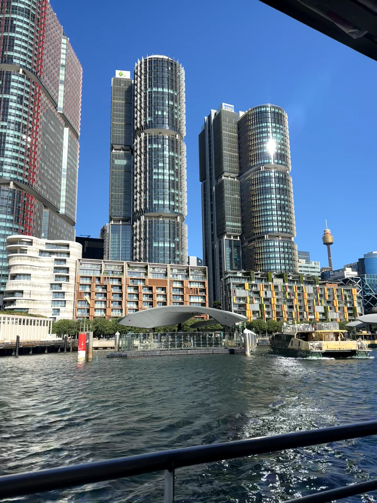

+++
author = "Sathyajith Bhat"
categories = ["Life"]
tags = ["weekly-notes", "gaming"]
places = "Sydney"
type = "post"
series = ["Weekly notes"]
url = "/weekly-notes-51-2025/"
title = "Weekly notes 51/2025"
date = 2025-12-20T12:00:00Z
summary = "Week 51 summary - unexpected events and holiday prep."
images = ["/weekly-notes-51-2025/thumb-intl-towers-ferry.jpg"]

+++

_Thumbnail image: I love taking the Ferry back home - so awesome to live in Sydney where a Ferry is public transport. Pictured here are the International Towers and Sydney Tower Eye (aka Westfield Tower)._

### What's been happening

Last Sunday was a horrible day in Sydney - a [terrorist attack](https://en.wikipedia.org/wiki/2025_Bondi_Beach_shooting) occurred in Bondi Beach, killing 15 people. The police killed one gunman while the other gunman was critically injured. Two car bombs were also found and thankfully removed before they were detonated. We were at home when it occurred, just about to step out for a walk. My thanks to all those who reached out to me to check in to see if we were okay. I must also call out the acts of heroism by [several civilians](https://www.smh.com.au/national/nsw/four-heroes-tried-to-stop-the-bondi-terrorists-three-paid-with-their-lives-20251216-p5no4d.html) - attacking/subduing the gunmen even at the [risk of their lives](https://www.bbc.com/news/articles/cx2341yx719o) and to the NSW Police Force for their quick response.

It's been another hot week, with multiple days of extreme heat and heatwave warnings. There was only so much that the air circulators and the fans could do, so the aircon came on, helping to cool down the temperatures. I wonder how it'll be in the new home - we have aircons in the kitchen/dining area and the living room, but none in the bedrooms. I suppose we'll know once we move there. Speaking of which, we let our real estate agent for the current property know that we'll be vacating. I've also scheduled the move with the removalists. Only a month to go for the move! Exciting times ahead!

As we head into the Christmas break, work is also winding down. Many of my colleagues/teammates are away or will be away from next week. I'm looking forward to the break - Jo will be on her shutdown and while I don't have a shutdown, I have taken a few days off. Looking forward to the break and to some relaxed time off in Brisbane.

### What I've been playing

Path of Exile 2 - I started playing the new league of Path of Exile 2 with the hollow palm monk build - the Hollow Palm Technique passive lets you attack with both your hand slots empty, but behaves as if you have a quarterstaff equipped. The passive also gives a huge boost to defenses and attack speed, giving the gameplay a very fast, flowing style - as long as you're not going against a boss. That's because for bosses we make use of the Tempest Bell skill, which requires building up combos. This is rather annoying in PoE2 as you can't afford to be still, especially in boss fights. The first 23 levels were a bit slow and tedious but once you unlock the Hollow Palm Technique passive, it gets a lot better. I'm nearly at the end of the campaign - the interludes remain which I am sure will be a challenge. 

### What we ate

[Anjappar, CBD](https://maps.app.goo.gl/yjCaE4XtDcNRiqGL9) - I joined Jo for lunch because she said she was going to this place and I wanted to grab parotta and some curry. I ended up getting the pepper chicken with a pomfret fish fry. The pepper chicken was really good and had just the right amount of heat. The pomfret fish fry was good as well - a bit bland but the fish was fresh. 



[Kirribilli Seafoods, Kirribilli](https://maps.app.goo.gl/YFDXFGc1PexYZ85d7) - We stopped by here for dinner when returning from the office. We'd previously been here and loved the fish and chips and wanted to try something else. Jo got the fish and chips while I got the grilled platter with grilled calamari, grilled scallops, grilled prawns, grilled fish and chips. The fish and assorted seafood were pretty fresh though from a taste perspective, the beer-battered fish and chips were better. 



### Music of the Week

This week's [music of the week](https://www.youtube.com/watch?v=t0vHiKxpXos) is "Foaming" by Day We Ran, an Australian rock band. This song comes up every now and then in my Spotify playlists. The song has some great guitar riffs and lovely vibes. Highly recommend if you like surf-rock style songs.



### Link of the week

The Wall Street Journal has a [nice video](https://www.youtube.com/watch?v=SpPhm7S9vsQ) on how they ran a vending machine powered by Anthropic's AI and how it went. Fun video showing the limitations of current large language models and the agents.

Fun video from WSJ on their results of running a vending machine powered by Anthropic's Claude and its effects.



### Thanks for reading.

Thanks for reading and have a great week ahead.

Subscribe to my weekly notes:

- [Email newsletter](https://sathyabhat.substack.com/)
- [RSS feed for the weekly notes](https://sathyabh.at/series/weekly-notes/index.xml)
- [RSS feed for my site](https://sathyabh.at/index.xml)
