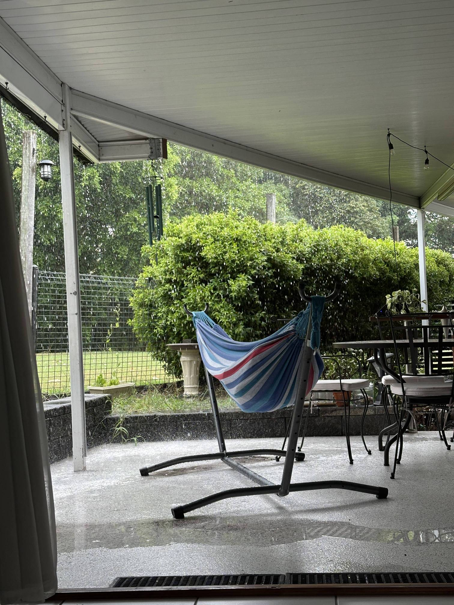

+++
author = "Sathyajith Bhat"
categories = ["Life"]
tags = ["weekly-notes"]
places = "Sydney"
type = "post"
series = ["Weekly notes"]
url = "/weekly-notes-52-2025/"
title = "Weekly notes 52/2025"
date = 2025-12-28T12:00:00Z
summary = "Week 52 summary - a weekday getaway."
images = ["/weekly-notes-52-2025/thumb-brisbane-2025.jpg"]

+++

### What's been happening
It's been a pretty relaxed week. We started by working from home on Monday and Tuesday. We also went to back-to-back gym sessions and decided to take that up because we wouldn't be available in Sydney after that. And then, for the Christmas holidays, we flew over to Brisbane, spending some time with family.

Our flight was departing at 8:30 and as luck would have it, it was delayed. I’m not quite sure what actually happened, but all flights flying into and coming out of Brisbane were delayed by an hour or so. Since I had lounge access, Jo and I went over to the Qantas lounge and chilled there, waiting for flight updates. At one point I wondered if we would be able to get to Brisbane in time because our flight departure time was getting delayed beyond the other scheduled flights. Sydney airport also has a flight curfew and no flights depart after 11pm, so we were wondering if we would fly out at all. Thankfully, after another delay, we saw the update to head to the gate and thus we flew off to Brisbane with a two-hour delay. 



Thankfully, the flight was uneventful. Although the flight was for an hour and a half, the logged flight was only half an hour - Brisbane doesn’t observe daylight saving so we went back an hour when we landed in Brisbane. Jo's cousin sister and her husband picked us up at the airport and we went over to their house, staying there the whole time.

The next few days were quite relaxing - we didn’t do anything. We just spent most of the time at home - eating, sleeping, talking.



It was very hot and humid most of the days we were in Brisbane, making outdoor walks a nightmare. We also had other guests at home - Jo’s cousin was pet-sitting their friend’s dog - the very sweet, quiet, and affectionate dog called “Vada”. Jo and I wanted to get some steps in during our stay, so we took Vada out for a walk on two different days. 



We also got to try out some amazing food cooked by Jo’s sister-in-law and her husband. 



Christmas in Australia is celebrated with friends and family, great food, and traditional Christmas crackers. These crackers are small festive decorations that make a cracking sound when pulled open and contain a paper crown and often, a small gift or a joke. So for lunchtime, much like during my last visit, we did the same this time around.



On the last day, we went for a small drive around Ipswich, with our brother-in-law giving us a brief overview of the city and the various landmarks. We thought of going to a pub but it was closed due to Boxing Day and we ended up checking out an Indian/Nepalese restaurant.

### What we ate

[Indus, Ipswich, QLD](https://maps.app.goo.gl/19YbqgWu2PxHC9px6?g_st=ic) - We stopped by here for dinner since most other places were closed. While listed as an Indian and Nepalese restaurant, the food made it clear that the Nepalese food was their strong point. We ordered a Newari Khaja set (a traditional Nepalese platter featuring savoury snacks), chowmein, fried rice, chilli chicken, and Jhol Momo. As mentioned, we preferred the Nepalese items over the Indo-Chinese ones as the latter was a bit bland. That said, none of the food was bad and we enjoyed the food.

### Music of the Week

The Think Floydian’s got a [new video out](https://www.youtube.com/watch?v=9cnUJ1yg994) - this time covering Pink Floyd’s Echo and it is glorious.



### Link of the week

YouTube once again comes through with a banger of a recommendation - this one where a guy from Norway who ordered a mini excavator from China! Great [video](https://www.youtube.com/watch?v=mJ8kgZoNGjg).



### Thanks for reading.

Thanks for reading and have a great week ahead.

Subscribe to my weekly notes:
- [Email newsletter](https://sathyabhat.substack.com/)
- [RSS feed for the weekly notes](https://sathyabh.at/series/weekly-notes/index.xml)
- [RSS feed for my site](https://sathyabh.at/index.xml)
