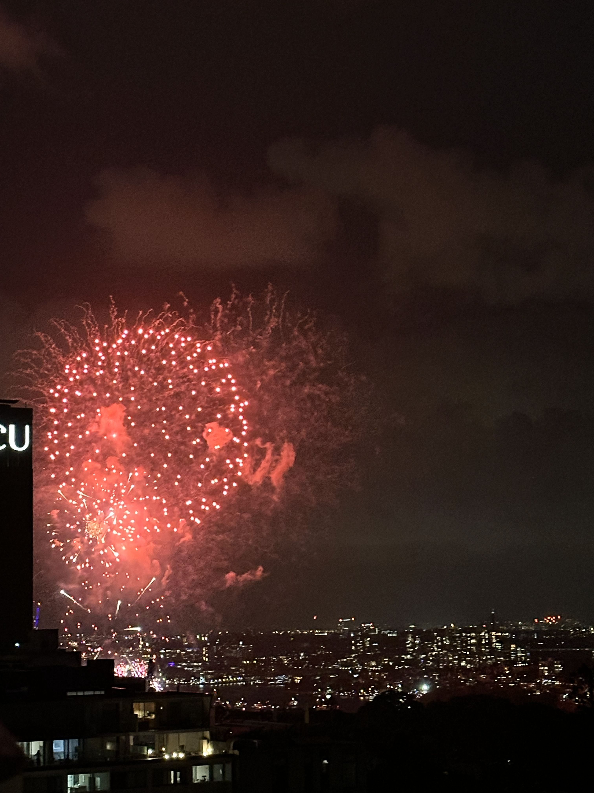

+++
author = "Sathyajith Bhat"
categories = ["Life"]
tags = ["weekly-notes", "gaming"]
places = "Sydney"
type = "post"
series = ["Weekly notes"]
url = "/weekly-notes-01-2026/"
title = "Weekly notes 01/2026"
date = 2026-01-04T12:00:00Z
summary = "Week 01 summary - New Year's Eve and the start of 2026."
images = ["/weekly-notes-01-2026/thumb-ny-2026.jpg"]
+++

_Thumbnail image: New Year Fireworks._

### What's been happening

Happy New Year and welcome to 2026! Hope everyone had a great start to 2026. This week has been a mix of a little bit of work, some relaxation and some travel along with the impending feel of doom due to end of holidays. The week started quietly - I was working till New Year's Eve and then took a break for a couple of days. Jo's Christmas holidays continued till end of this week. I also took the time to write a few blog posts. The first set of blog posts were a look back at the past year: 

- [The wrap-up of wrap-ups for 2025](/wrap-up-of-wrap-ups-2025) 
- [A Look Back at 2025](/a-look-back-at-2025/)

I also wrote a post on my [tech blog](https://sathyasays.com/) about how to [keep your pacman cache clean on Arch Linux](https://sathyasays.com/clean-up-pacman-cache-automatically-on-arch-linux/).

For New Year's, we didn't plan anything special. Sydney can get a bit crazy and crowded during this time, particularly around the vantage points for the fireworks. This was emphasized when we went for a walk to Kirribilli on New Year's Eve morning and huge crowds gathering there. Apparently, people had been camping since the previous day to be the first in the queue to get a good spot for the fireworks. We just stayed at home. We had a good view of the fireworks from our apartment terrace, thus for the 9pm fireworks, we went over there.

For the midnight fireworks, we opted to stay in and check the fireworks on TV. It was a relaxing way to usher in the new year. For the first day of the year, I had a blood donation appointment in the morning. On reaching the clinic, I was asked if I had some extra time and if I could donate plasma instead. Since the Bondi incident, many people have been coming forward to donate blood, which is great. However, plasma donations are still low, so I agreed to do that. The process took a bit longer than usual, but it was good to be able to help out. Post donation, we went over to Chinatown for lunch and head back home.

With both of out of office till the weekend and wanting to do something, we decided to make a small day trip to Gosford. Check out the blog post [A Day Trip to Gosford](/gosford-2025/) for more details. It was a nice break from the city and we had a good time exploring the area.

Then for the weekend, we stayed in and relaxed.

### What we ate

[Mother Chu's Taiwanese Gourmet, Haymarket](https://maps.app.goo.gl/5uAtBLED4mUkZadn8) - A small little Taiwanese restaurant nestled in the alleyways of Chinatown, Mother Chu's is known for their Taiwanese home-style food including  congee, glutinous rice rolls and more. Our favourite here is the Tawiwnese style Crispy Salted Chicken which we always order whenever we visit. We also ordered the pan fried dumpling that were good as well. 



### Link of the week

Back in Mid-2000s, Abit was a popular brand of motherboards, especially popular with overclockers and enthusiasts. I had no idea that by the end of 2008, they went out of business. This [article](https://dfarq.homeip.net/what-happened-to-abit-motherboards/) talks about what led to their downfall. Good read if you are into tech history.

### Thanks for reading.

Thanks for reading and have a great week ahead.

Subscribe to my weekly notes:

- [Email newsletter](https://sathyabhat.substack.com/)
- [RSS feed for the weekly notes](https://sathyabh.at/series/weekly-notes/index.xml)
- [RSS feed for my site](https://sathyabh.at/index.xml)
