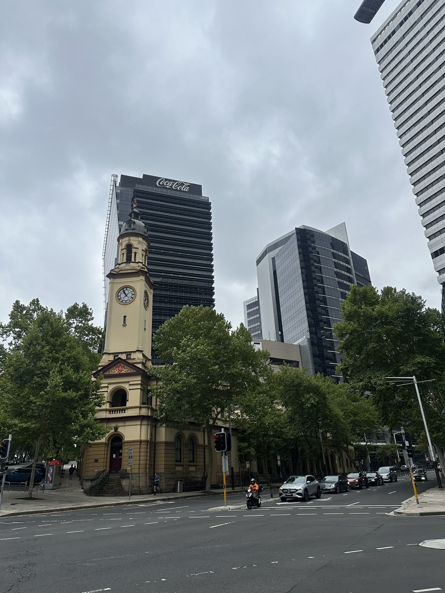

+++
author = "Sathyajith Bhat"
categories = ["Life"]
tags = ["weekly-notes", "gaming", "home-move"]
places = "Sydney"
type = "post"
series = ["Weekly notes"]
url = "/weekly-notes-02-2026/"
title = "Weekly notes 02/2026"
date = 2026-01-11T12:00:00Z
summary = "Week 02 summary - Another hot week in Sydney; move preparations"
images = ["/weekly-notes-02-2026/thumb-north-sydney-post-office-26.jpg"]

+++

_Thumbnail image: North Sydney Post Office._

### What's been happening

At the risk of sounding like a broken record, it's been another hot week here in Sydney. The temperatures have been hovering around mid 30s Celsius and it's been quite uncomfortable to be outside for long periods. The worst was on Saturday which recorded at 40 degree Celsius in North Sydney, and if that wasn't high enough, mid-40s in [Western Sydney](https://www.abc.net.au/news/2026-01-10/fire-danger-heatwave-winds-expected-across-nsw/106215426). It was so bad that the temperatures were at 35 degrees Celsius even as late as 8:30pm. That is just ridiculous. By around 10pm, a southerly buster[^1] cooled down the city and it's been cloudy today.

With our settlement and move coming close, the past week has been a book-and-organize everything week. I sorted out of the pending things that were required prior to the move:

* Get the EcoBox reusable boxes order in so we can pack everything and be prepared for the move
* Arrange for pre-move cleaning of the new house
* Arrange for post-lease cleaning of the current apartment
* Update the electricity and gas disconnection and connection dates
* Work with CSIRO to arrange for collection of the temperature and humidity loggers we had installed as part of the [CSIRO Apartment Energy Study](/weekly-notes-47-2025/) project

And while these were being done, our real estate agent let us know they were setting up a open house viewing for the new tenants for the weekend. We didn't think it would start this weekend, so with this notice, we went on a panic cleaning of the apartment. Plus, we had a bunch of packing material etc strewed through the unit, so had to clean and arrange those out. I vacuumed the outdoor balcony, cleaning the cobwebs and other general dirt in the outdoor balcony while Jo was cleaning up the bedrooms and bathrooms. We got the house in a nice place for the viewing. During the rental viewing, Jo opted to head over to a cafe while I stayed back to handle the viewing. The rental viewing was interesting - it wasn't long before when we were on the other side, heading from unit to unit, checking out the place out, trying to figure out why the place was being vacated out. A few folks asked me the odd question or two: a few asking about facilities, a few people asking about air conditioning and things like that, while a few were really puzzled why the ensuite was in a office room - I had to let them know we opted to use the master bedroom as my office space as it was much brighter. I realized how bright the guest bedroom (now our master) is - and it was the blinds down that make it so much darker. We had about 15 people come in for the viewing, per the agent. 

I don't know when the next viewing will be - we've been told by the real estate agent they plan to have two viewings a week. So I assume we'll have one in the middle of the week and another on the next weekend.

Apart from this, we went over to Bunnings[^2] midweek to pick up some packing supplies - bubble wrap, packing tape, couple of cardboard boxes etc. As mentioned above, we have a whole lot of reusable packing boxes coming our way this week - these cardboard boxes are for some immediate use. While at Bunnings, we spent some time looking at the different aisles, checking out different flooring options, lighting options etc for the new house - nothing concrete yet, but it's good to get some ideas.



On Sunday morning, we did our now-usual walk to Kirribilli and back, stopping at the local cafe for breakfast. The walk was nice with a cool breeze coming in from the harbour, making it a pleasant experience. The wind was strong enough to bring in some dew making the air feel fresh and cool. It was a nice change from the hot weather we've been having. If there's one thing that we'll miss the most - I think it will be this walk to the lookout. There's a few reserves around the new house, so we can explore those, but I think this walk to Kirribilli will be missed. Kirribilli Markets was also on this Sunday, so there were a lot of people around the area, checking out the different stalls. Jo found a warrior robot to be most interesting, so picked it up as decor for the new house. We also spotted this incredibly cute mini-cat-succulent-pot, so picked that up as well.



<blockquote class="mastodon-embed" data-embed-url="https://mastodon.social/@Sathyabhat/115873438897621172/embed" style="background: #FCF8FF; border-radius: 8px; border: 1px solid #C9C4DA; margin: 0; max-width: 540px; min-width: 270px; overflow: hidden; padding: 0;"> <a href="https://mastodon.social/@Sathyabhat/115873438897621172" target="_blank" style="align-items: center; color: #1C1A25; display: flex; flex-direction: column; font-family: system-ui, -apple-system, BlinkMacSystemFont, 'Segoe UI', Oxygen, Ubuntu, Cantarell, 'Fira Sans', 'Droid Sans', 'Helvetica Neue', Roboto, sans-serif; font-size: 14px; justify-content: center; letter-spacing: 0.25px; line-height: 20px; padding: 24px; text-decoration: none;"> <svg xmlns="http://www.w3.org/2000/svg" xmlns:xlink="http://www.w3.org/1999/xlink" width="32" height="32" viewBox="0 0 79 75"><path d="M63 45.3v-20c0-4.1-1-7.3-3.2-9.7-2.1-2.4-5-3.7-8.5-3.7-4.1 0-7.2 1.6-9.3 4.7l-2 3.3-2-3.3c-2-3.1-5.1-4.7-9.2-4.7-3.5 0-6.4 1.3-8.6 3.7-2.1 2.4-3.1 5.6-3.1 9.7v20h8V25.9c0-4.1 1.7-6.2 5.2-6.2 3.8 0 5.8 2.5 5.8 7.4V37.7H44V27.1c0-4.9 1.9-7.4 5.8-7.4 3.5 0 5.2 2.1 5.2 6.2V45.3h8ZM74.7 16.6c.6 6 .1 15.7.1 17.3 0 .5-.1 4.8-.1 5.3-.7 11.5-8 16-15.6 17.5-.1 0-.2 0-.3 0-4.9 1-10 1.2-14.9 1.4-1.2 0-2.4 0-3.6 0-4.8 0-9.7-.6-14.4-1.7-.1 0-.1 0-.1 0s-.1 0-.1 0 0 .1 0 .1 0 0 0 0c.1 1.6.4 3.1 1 4.5.6 1.7 2.9 5.7 11.4 5.7 5 0 9.9-.6 14.8-1.7 0 0 0 0 0 0 .1 0 .1 0 .1 0 0 .1 0 .1 0 .1.1 0 .1 0 .1.1v5.6s0 .1-.1.1c0 0 0 0 0 .1-1.6 1.1-3.7 1.7-5.6 2.3-.8.3-1.6.5-2.4.7-7.5 1.7-15.4 1.3-22.7-1.2-6.8-2.4-13.8-8.2-15.5-15.2-.9-3.8-1.6-7.6-1.9-11.5-.6-5.8-.6-11.7-.8-17.5C3.9 24.5 4 20 4.9 16 6.7 7.9 14.1 2.2 22.3 1c1.4-.2 4.1-1 16.5-1h.1C51.4 0 56.7.8 58.1 1c8.4 1.2 15.5 7.5 16.6 15.6Z" fill="currentColor"/></svg> 
Post by @Sathyabhat@mastodon.social
 
View on Mastodon
 </a> </blockquote> 

### What I've been playing

Diablo IV, Season 11 - The season of Divine Intervention - With all the 'admin' working going on, I didn't have much energy to play Path of Exile 2 and wanted to do some brainless gaming. So I went back to Diablo IV for a bit of mindless monster slaying. I started a new character and got it to level 60, now slowly progressing through the paragon levels and torment tiers. I picked up a Spiritborn class this time and leveling with it has been a lot of fun. The Spiritborn class is quite agile, fast attacking class - that with Diablo IV's visceral feedback gives plenty of dopamine kicks. 

### What we ate

[Venn Cafe](https://maps.app.goo.gl/y3akBzgf5bk3cu5V6) - Jo went to our usual Humm Cafe while waiting for the rental viewing to finish. After it was done and when I walked over there, we realized that it was closing down for the day so we went over to Venn just a short walk away. Usually, we are in Venn a lot earlier - visiting here during lunch time meant that I could try out their steak sandwich again, which I absolutely loved [last time around](/weekly-notes-27-2025/). And it was no different this time around - the steak sandwich was juicy, tender and packed with flavour. Jo had the satay chicken wrap which she said was good as well. Because it was so hot, I had the iced mocha while Jo had the 'Tromoso' juice - a mix of lemon, watermelon, carrot, orange which was pretty good as well.



[BTB Kirribilli](https://maps.app.goo.gl/y4u6oeEMma1rF2N66) - Jo wanted to stop by here before we move from this place as they have a rotating, season specific menu. We went over on Sunday after our walk to Kirribilli and picked up a few things. I had the sausage-and-egg muffin, while Jo had the avo smash on dark rye bread with grilled watermelon and macadamia salsa. The sausage patty was beef and roo and was really juicy. We had our usual coffee orders as well. I pointed Jo to the crocodile chorizo toastada and thought I was getting that - she wasn't too pleased to know I went for the sausage and egg muffin instead!



### Music of the Week

Mechagnome's [Solo Sailing](https://www.youtube.com/watch?v=bMas9G_yIkw) with their tunes gets my vote this week - check it out.



### Link of the week

A little late because I missed it, but Tom BetGeorge's Christmas Show is absolutely worth a watch - [Tom BetGeorge Christmas Show 2025](https://www.youtube.com/watch?v=enhhtPZMwCE).



### Thanks for reading.

Thanks for reading and have a great week ahead.

Subscribe to my weekly notes:

- [Email newsletter](https://sathyabhat.substack.com/)
- [RSS feed for the weekly notes](https://sathyabh.at/series/weekly-notes/index.xml)
- [RSS feed for my site](https://sathyabh.at/index.xml)

[^1]: A southerly buster is a weather phenomenon in which a strong, cool southerly wind moves up the coast of New South Wales, Australia, often bringing relief from hot summer temperatures.

[^2]: Bunnings is a large home improvement retailer in Australia.
