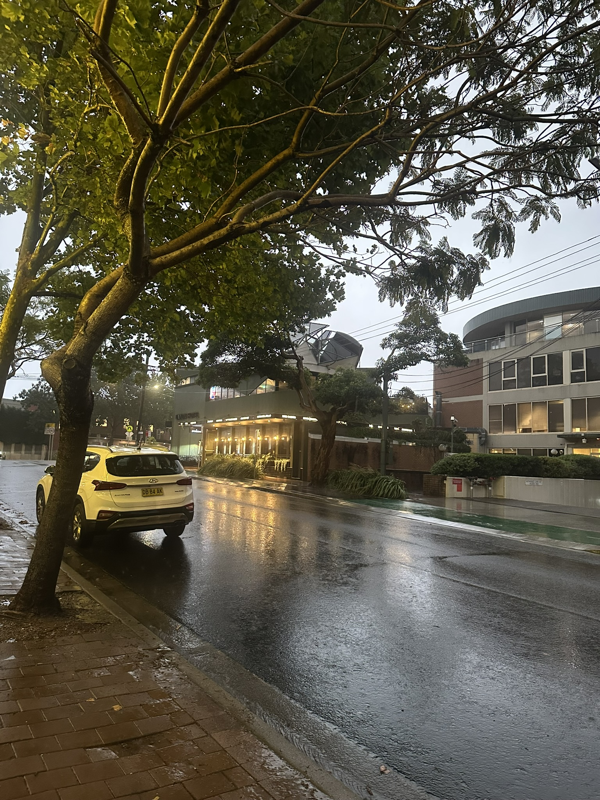

+++
author = "Sathyajith Bhat"
categories = ["Life"]
tags = ["weekly-notes", "gaming", "home-move"]
places = "Sydney"
type = "post"
series = ["Weekly notes"]
url = "/weekly-notes-03-2026/"
title = "Weekly notes 03/2026"
date = 2026-01-18T12:00:00Z
summary = "Week 03 summary - so close, yet so far."
images = ["/weekly-notes-03-2026/thumb-rainy-north-sydney.jpg"]
+++

_Thumbnail image: Stormy North Sydney._

### What's been happening

It’s storm time! After [last week’s blazing](/weekly-notes-02-2026/) heatwave, it’s been raining all week in Sydney. The rain has cooled down temperatures but it’s pretty crazy to see temperatures drop 20 degrees in a span of a day. 

We’re getting closer to our settlement. This week, we reached out to our mortgage broker and conveyancer to confirm everything is in place. The real estate agent also booked a slot for the final pre-settlement inspection (scheduled for Monday morning), and our conveyancer asked us to call them up and let them know if the pre-settlement inspection goes per plan so they can sign off. Exciting times, we’re only a few days away (hopefully) and then we’ll have the made-move-dash. Jo & I have taken the days off for Monday (settlement day) and Friday (our move day). I’ve let my team know my availability is spotty due to the upcoming move. I’m really grateful that my work allows for flexibility for things like this. 

Men That Move, our movers, also delivered their stack of reusable boxes that we’ll use for the move. We haven’t quite started packing up into these boxes but suffice it to say we have _some_ progress in packing.



On Saturday, we met up with our friends from the guitar class. We hadn’t yet told them that we’re moving away from here, figured it would be better to let them know in person instead of over text. And since we missed the last term of guitar class, we hadn’t met them in a few months, so would be good to catch up. In the evening, we went over to Ambi’s Chai Bar to grab tea - the weather certainly was really good for a chai. We had some roti and chicken curry with it. While returning home, Jo found a lost passport and a purse with a bunch of cards in it. Not knowing what to do, we went over to the nearby police station the next day and dropped it off there.



And over the week, I managed to complete and publish my [YNAB Weekly Wrap](https://github.com/SathyaBhat/ynab-weekly-wrap) to Github. YNAB Weekly wrap is a Go-based tool that fetches your [YNAB](https://www.ynab.com/) budget data  and sends a formatted financial wrap report to a Telegram private group. [Jo](https://joshenoy.me/) had built a C# version [a few years ago](https://github.com/joshenoy/YNABReportGenerator) and that's been running as an Azure function. Since Azure functions do not have free tiers, it'd been charging me a trickle amount and I wanted to revamp it and run it on my homeserver. I also wanted a simple project to try [AmpCode](https://ampcode.com/) with, so I decided to give it a shot.  For now it works and I'll update it at a later time to clean up some code.

### What I've been playing

I’ve been playing a lot of Diablo IV and have got my Spiritborn to Torment 4. Now that I’ve played both Path of Exile 2 and Diablo IV extensively, I can see the basic design philosophy differences across PoE 2 and Diablo IV - Diablo gives you all the loot and gear that you need to start out your ultimate build, but only just - most of the stat ranges will be at low levels and you won’t have the mats required to completely spec it out. That’s where the endgame grind comes in, giving you an incentive to keep doing the content over and again if you want the absolute best of rolls. 

Path of Exile 2 on the other hand, is so much harder - from the content, to the item drops, to the crafting - the game very much incentivises to get the required item via trade. Sure, you have all the avenues to build and craft the item but that requires a lot of currency that you won’t have, especially at the start of the season. This makes league starts difficult and frustrating, especially if you can only play a few hours. By the time you’ve got a few currency items required to trade, inflation has already kicked in and you’re priced out. Not too different from the Australian real estate market, I might add. 

It seems the only real way to progress in Path of Exile 2, especially if you have limited time is to trade with whatever scraps you can get to get the gear required to play through the higher difficulty content and farm more currency to get even more GG gear. I’m not happy with either approaches - Diablo IV goes from reasonably ok to ludicrously easy very fast (really the only challenge in D4 is health sponge and the one shots) while in Path of Exile 2 you have a lot more dangerous foes and one shots as well. I’m not spending more time in Path of Exile 2 for now because the endgame mapping is set to be overhauled and at the current state, it’s not really engaging.

### What I listened to

[Project Hail Mary](https://www.audible.com.au/pd/Project-Hail-Mary-Audiobook/B08GB646KR) - I started listening to Project Hail Mary audiobook on Audible (thanks Amazon for the 3-month free sub) and was.. amaze, amaze, amaze!!! (sorry, IYKYK and all that jazz). Seriously though, I did have a really good time listening to it. As someone who’s still trying to get their brain to focus on something, I’d been listening to it as part of my office commute (which currently is pretty short, at 30 mins end-to-end, but will increase soon) as well as when we were traveling during the [house hunt](/tags/house-hunt/). Project Hail Mary is a sci-fi novel about a person who wakes up not knowing who he is, what he is supposed to do and where he is and slowly starts unraveling what’s going on. The plot advances in the current time with flashbacks filling in the backstory about why is he suffering from amnesia and slowly fills the reader with the premise and what he’s trying to do. I found the flashbacks an interesting way to tell the reader what’s happening, and the flashbacks become less frequent as the novel progresses further. There were times when what was about to happen was completely predictable, though the final chapters were a complete surprise (in a good way) and I must admit I didn’t see the end coming and did manage to evoke a good, emotional response in me. 

While the novel was good for the most part - it isn’t without faults. I found myself zoning out on more than a few occasions, particularly due to some excessive description of unwanted stuff. There’s also a lot of tedious content that could have easily been trimmed without affecting the plot and the storytelling. Some of the characters are badly stereotyped caricatures of their nationalities (and the narration here adds to this effect, especially due to the assumed accents) and there are characters who are dropped unceremoniously without a reference, I suppose it’s on us as a reader to leave it to our imagination as to what happens to them. Many of the chapters end in cliffhangers with the next chapter starting in a flashback which can be really grating at times. 

That said, it’s a great introduction for anyone who is semi-interested in sci-fi or audiobooks, and one that I think that many will find a good first book to listen to.

### Music of the Week

Leon Bridges & Khruangbin’s very haunting song “Mariella” has been on top of my mind this week. Give it a [listen](https://www.youtube.com/watch?v=QodSqlgygPs).



### Links of the week

A few interesting articles/videos that caught my eye:

* Andrew Doran’s got a [post about tools](https://andrewdoran.uk/blog/2025/12/20/tools-for-discovering-the-indieweb/) for discovering IndieWeb
* Suhas’s lovely post on [Breakfast dishes of Karnataka beyond Idli Vada Dosa](https://www.kashyapsuhas.com/blog/breakfast-dishes-of-karnataka-beyond-idli-dosa-vada) (thanks to Abhinav’s excellent [IndieWebClub](https://blr.indiewebclub.org/) aggregator - have found a lot of good reads)
* RampLabs on [We Put Claude Code in Rollercoaster Tycoon](https://labs.ramp.com/rct)
* [Thejesh’s](https://thejeshgn.com/) annual Nagarathna Memorial Grant for 2026 is now [Open for Applications](https://thejeshgn.com/2026/01/15/nagarathna-memorial-grant-2026-open-for-applications/)
  

### Thanks for reading.
Thanks for reading and have a great week ahead.

Subscribe to my weekly notes:
- [Email newsletter](https://sathyabhat.substack.com/)
- [RSS feed for the weekly notes](https://sathyabh.at/series/weekly-notes/index.xml)
- [RSS feed for my site](https://sathyabh.at/index.xml)
