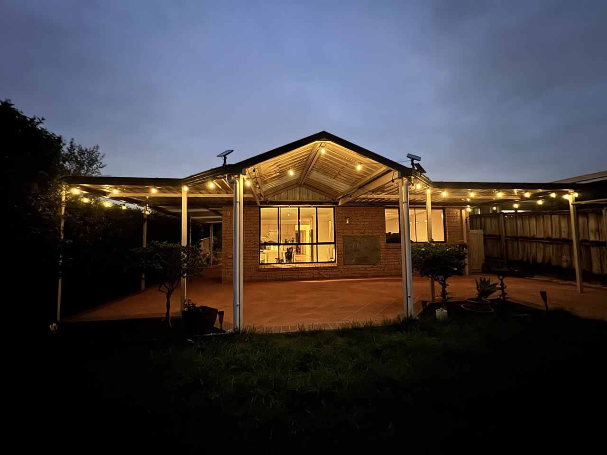

+++
author = "Sathyajith Bhat"
categories = ["Life"]
tags = ["weekly-notes", "home-move"]
places = "Sydney"
type = "post"
series = ["Weekly notes"]
url = "/weekly-notes-04-2026/"
title = "Weekly notes 04/2026"
date = 2026-01-26T12:00:00Z
summary = "Week 04 summary - new home owners!"
images = ["/weekly-notes-04-2026/thumb-new-home.jpg"]
+++

_Thumbnail image: Our new home._

### What's been happening

We’re new home owners in Sydney! A decade ago, we bought an apartment in Bangalore and thought “we would settle”, but life has a way of doing things. 

Monday morning started off with us heading over to the new house and completing the pre-settlement inspection. The goal is to ensure the items listed per contract of sale are still present and nothing is obviously missing. After a quick check of the appliances and utilities, we gave the all okay to the real estate agent and then to our conveyancer to go ahead.



From there, we walked over to The Library near Stanhope Village centre and signed up for the library membership. By now it was about 11am and we still hadn’t had breakfast so we went to a nearby cafe to have some breakfast. The cafe was in Stanhope Village Center which is a big shopping centre with many different shops - one of them being Big W. We needed some sleeping bags for our stay over day after, so we decided to get one. After looking some sleeping bags, we decided against the bag and bought an inflatable air mattress instead. The mattress wasn't really comfortable - most of the time it felt like Jo would be bounced off it when I moved and vice-versa. 

From there we got back home via a long-ish train ride - thanks to me misjudging the direction of travel. We ended up heading towards Blacktown when we meant to head the other way. Ah well, lesson learnt. While heading back, Jo decided to stop by and pick up a mirror she had seen at an antique shop so we went over to Crows Nest to pick it up and then reached home. 

We sat patiently waiting for a call from our conveyancer to hear confirmation that the settlement had happened and this came in a few hours later. The real estate agent called us an hour or so later to ask about handing over the keys - and given we would be staying over on Wednesday, we packed a few essentials and went over so we can pick up the keys and drop the things off. We didn’t stay overnight though. We came back home still in disbelief that we have the place. 

Tuesday was spent in some more packing. I went to the office but returned early and disconnected all the wires/cables/adapters from the electronics we have and put them in the packing boxes. 

Wednesday was the day we were staying over at the new place. We were having cleaners over at the new house on Thursday morning and getting to there from our old house was bit of a travel - one that we did not want to do early morning. So in the evening we started heading up but first had to buy some buy stools (since we wouldn't have any furniture and Jo was working the next day), we first stopped by Ikea in Marsden Park. In our typical fashion, we messed that up as well by not checking the address and we were dropped off at Ikea's Customer Distribution Center that was a few kilometers away rather than the retail store. With only 20 minutes to spare before Ikea closing up, we took an Uber to the retail store, and went straight to the pick up, thanks to Jo looking up where we could get the required bar stools. With the furniture in place, we went over to the house, did the customery milk-boilover ritual and then set about setting the air-mattress. 



I had placed a request with Superloop to move the Internet connection over, and I realized that the network was actually not working. The router itself wasn't starting up and advertising the wifi networks. I tried to reach out to Superloop on livechat via their app and that was a 30 minutes and then the wait time just increased. Frustrated, I called them on the phone and they hold me they have received the order and it's with NBN to activate it. A request for timeline and all I got was a "it can be up to 24 hours" blurb. Since there was nothing else to do, I gave up and cut the call. 10 minutes later, the router started up and miraculously I had Internet. Mmm just a "co-incidence"  that this happend just as I called them up, nothing to see here, move along.

Anyway, I was just happy to have the network running so Jo could work here without having to rely on her mobile hotspot. Our new home has solar panels and comes with a WiFi adapter, so I also paired the adapter with the home network so I can have some stats on the solar power generation. More on this for another series on the house. The next day, I took the bus to the office, getting a preview of how the commute would be. It wasn't too bad to be honest - a 5-minute walk to the bus stop. The express bus to the city runs every 8-or so minutes during morning commute times and the bus was faily empty. We'll see how the next week's commute goes. 

Once again, I left early for home so I could continue packing up. Once Jo came later in the evening, we were going full-steam ahead on the packing, only stopping briefly at times and also for dinner. I guess that's what happens when you leave the packing for the last moment.. 

We continued packing stuff and by about 11:30pm we were almost done. There were a few things still pending but I told Jo I'm beat and will go to sleep and wake up the next day at 5am to finish off the last few things.



Come Friday moring, we were up bright and early and finished off the last few things. The movers were scheduled to come at 7am and right on cue at 06:50pm I got a call saying they're just around the corner. Our building manager had told us he'd put up the curtains on the lift and had asked us to let the movers know to only use the lift that had the curtains on. However, the curtains were not up yet when the movers arrive. I tried to call the manager but I didn't get a reply so I asked the movers to use either of the lifts. The movers were from Men That Move and were very efficient. For our package, we had three guys - one was efficiently dismantling the bed frames, couch, and other other large items while the other two were moving away the boxes and the other dismantled items. All appliances, including my computer, monitors, etc were kept for last. Towards about 9:30am, the pace had slowed down a bit - and I noticed the curtains were up. I guess these folks started using the only lift that had the curtains on. As the number of boxes decreased, Jo said she'd head to the new house so that somebody would be around when the movers arrive - We don't have a car, and since we've gotten our PR, I can't drive on my Indian license anymore, so we're pretty reliant on public transport. 

By about 10:30am, the movers had completed moving all the items into the truck and were ready to leave. I verified the address that they were heading to and they started for the destination. I hadn't had any breakfast or coffee till now, so I decided to stop by Humm and grab a quick coffee and almond croissant. I sat down to have the croissant, wondering how much of the easy access to the cafes I'd miss. 

After a 15-minute break, I picked up some more remaining items and started to head to the new house. The movers arrived by about 11:40, with me reaching about 10-minutes later. Since the new place is an independent home on the ground level with garage, the movers backed in the truck into the driveaway and were unloading the boxes in the garage pretty fast. The bed, couch and other dismantled items were quickly assmembled by them, and the appliances were connected as well. In about an hour, these folks managed to unload 70 boxes of stuff and assemble two beds (a queen, another smaller day bed), a three-person couch with a chase and move two computer tables and a dining table into the house. Like I said, these guys were phenomenal. The driver then called up the office who confirmed with us everything was good and completed the payment.

All that was left to do was unbox and re-assemble the other things - and that's how the rest of the weekend went. I'm glad we had a long weekend with the Monday off, else it would have been too much to handle. But for now, we have our new home and we're excited to start living there.

### Music of the Week

Satin Jacket's [remix](https://www.youtube.com/watch?v=IR2QfCr4DpQ) of Tycho's "Japan" is a amazing and very awesome, chill track to kick start your weekend (or week?). 



### Link of the week
Gamer's Nexus has a [very cool video](https://www.youtube.com/watch?v=TcRGBeOENLg) about on modded/swapped components in GPUs to make unsanctioned, insane custom GPUs. 



### Thanks for reading.

Thanks for reading and have a great week ahead.

Subscribe to my weekly notes:

- [Email newsletter](https://sathyabhat.substack.com/)
- [RSS feed for the weekly notes](https://sathyabh.at/series/weekly-notes/index.xml)
- [RSS feed for my site](https://sathyabh.at/index.xml)
