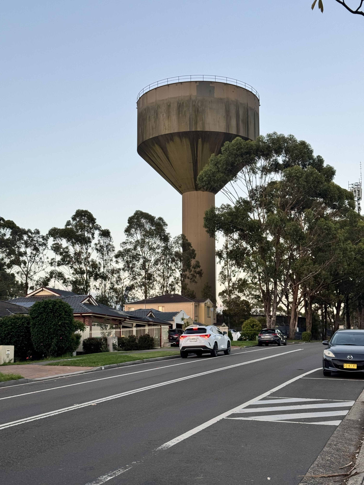

+++
author = "Sathyajith Bhat"
categories = ["Life"]
tags = ["weekly-notes", "gaming"]
places = "Sydney"
type = "post"
series = ["Weekly notes"]
url = "/weekly-notes-05-2026/"
title = "Weekly notes 05/2026"
date = 2026-01-31T12:00:00Z
summary = "Week 05 summary - settling into the new home."
images = ["/weekly-notes-05-2026/thumb-acacia-gardens-water-tower.jpg"]
+++

_Thumbnail image: Water Tower in Acacia Gardens. I couldn't find more details about this water tower._

### What's been happening

Wow, how time flies. Just last week we were stressing about the settlement and move, and here we are, a week later - fully relaxed and getting familiar with the new home. The first order of business was to unbox all the pending stuff we had packed in the reusable boxes. We spent most of Sunday doing just that - especially setting up mine & Jo's desktops, the [NAS](https://sathyabh.at/nas), the homeserver and other electronics. I also had to mount the monitors onto the monitor arms and adjust them. There was also the [Breville Bambino Plus](/weekly-notes-12-2025/) espresso machine and the Barazta Encore ESP grinter that needed to be re-assembled. All the electronics & gadgets - survived the trip and are working as expected. I did mess up installing the rubber gasket on the grinder and made a mess of the bench. But, that's been sorted. 

Jo asked me to setup a LAN cable for her desktop - her office being the place where the NBN NTD and the router is made it easier this time around to plug in the cable. That however, ended up breaking Internet connectivity for my desktop, due to me plugging in the LAN cable in the [wrong port](https://sathyasays.com/its-always-dns-part-n/)! Anyway, it was sorted out as well. Monday was a holiday due to [Australia Day](https://en.wikipedia.org/wiki/Australia_Day), so we took it easy and just relaxed at home. We walked over to Stanhope Leisure Center to check out the gym. The Leisure Center also has a pool attached to it, so we checked if they had swimming classes for adults - and thus I've managed to sign up to learn swimming starting Feb 9. 

We also met our next-door neighbours - an India couple from Delhi who've been living the area for 23 years. They invited us for tea later in the week. 

We both had office to go to on Tuesday - and that gave us a good representation of how the commute would be. The bus stop is only a 5-minute walk, and there's express bus into the city which gets us to office in an hour. We didn't have any toruble getting seats in the bus, and during the morning rush, the bus runs at a frequency of every 7-minutes, so all in all it was good. In the evening, we went over to BBB North Sydney for our usual PT session, and took the bus back home. For now, this commute/evening gym is manageable, so we're continuing with it.

On the weekend, we paid a visit to Ikea and Bunnings - the former because Jo wanted to get some curtain rods, curtains, some lamps and a few other things for the house. We went to Bunnings to check out some outdoor solar-powered lamps so the backyard can be nicely lit up. We already have a few solar lamps but couple of them aren't working so we wanted to replace them. I also wanted to check out some lawnmowers as the lawn has grown quite a bit and needs some trimming. After a lot of research from ChatGPT, YouTube, asking my colleagues and reddit, I've put in an order for a Ryobi 18v lawnmower (R18XLMW24 model if you're curious).

It's also been a very hot week with almost all days being over 34 degrees and Saturday's temperatures exceeding 38 degrees. I'm very glad to have solar panels for the house - having them helps us run the airconditioning in the house without having to worry about electricity bills as much - well at least during the day. And with the heat, the birds also made good use of the birdbath in the backyard.

<blockquote class="mastodon-embed" data-embed-url="https://mastodon.social/@Sathyabhat/115989093237780442/embed" style="background: #FCF8FF; border-radius: 8px; border: 1px solid #C9C4DA; margin: 0; max-width: 540px; min-width: 270px; overflow: hidden; padding: 0;"> <a href="https://mastodon.social/@Sathyabhat/115989093237780442" target="_blank" style="align-items: center; color: #1C1A25; display: flex; flex-direction: column; font-family: system-ui, -apple-system, BlinkMacSystemFont, 'Segoe UI', Oxygen, Ubuntu, Cantarell, 'Fira Sans', 'Droid Sans', 'Helvetica Neue', Roboto, sans-serif; font-size: 14px; justify-content: center; letter-spacing: 0.25px; line-height: 20px; padding: 24px; text-decoration: none;"> <svg xmlns="http://www.w3.org/2000/svg" xmlns:xlink="http://www.w3.org/1999/xlink" width="32" height="32" viewBox="0 0 79 75"><path d="M63 45.3v-20c0-4.1-1-7.3-3.2-9.7-2.1-2.4-5-3.7-8.5-3.7-4.1 0-7.2 1.6-9.3 4.7l-2 3.3-2-3.3c-2-3.1-5.1-4.7-9.2-4.7-3.5 0-6.4 1.3-8.6 3.7-2.1 2.4-3.1 5.6-3.1 9.7v20h8V25.9c0-4.1 1.7-6.2 5.2-6.2 3.8 0 5.8 2.5 5.8 7.4V37.7H44V27.1c0-4.9 1.9-7.4 5.8-7.4 3.5 0 5.2 2.1 5.2 6.2V45.3h8ZM74.7 16.6c.6 6 .1 15.7.1 17.3 0 .5-.1 4.8-.1 5.3-.7 11.5-8 16-15.6 17.5-.1 0-.2 0-.3 0-4.9 1-10 1.2-14.9 1.4-1.2 0-2.4 0-3.6 0-4.8 0-9.7-.6-14.4-1.7-.1 0-.1 0-.1 0s-.1 0-.1 0 0 .1 0 .1 0 0 0 0c.1 1.6.4 3.1 1 4.5.6 1.7 2.9 5.7 11.4 5.7 5 0 9.9-.6 14.8-1.7 0 0 0 0 0 0 .1 0 .1 0 .1 0 0 .1 0 .1 0 .1.1 0 .1 0 .1.1v5.6s0 .1-.1.1c0 0 0 0 0 .1-1.6 1.1-3.7 1.7-5.6 2.3-.8.3-1.6.5-2.4.7-7.5 1.7-15.4 1.3-22.7-1.2-6.8-2.4-13.8-8.2-15.5-15.2-.9-3.8-1.6-7.6-1.9-11.5-.6-5.8-.6-11.7-.8-17.5C3.9 24.5 4 20 4.9 16 6.7 7.9 14.1 2.2 22.3 1c1.4-.2 4.1-1 16.5-1h.1C51.4 0 56.7.8 58.1 1c8.4 1.2 15.5 7.5 16.6 15.6Z" fill="currentColor"/></svg> 
Post by @Sathyabhat@mastodon.social
 
View on Mastodon
 </a> </blockquote> 

With the house move however, we decided not to continue with the guitar class for now - it'd be just too far to get to. We told our guitar teacher that we wouldn't be continuing the class. He was kind enough to invite us for his band's performance. He is part of a world music band called Marsala. We went to their gig at a speakeasy in Marrickville and saw him belt the acoustic guitar while singing in Serbian, Turkish, Egyptian, Farsi, Russian, Italian, Greek, French, and one or two more. The entire room was buzzing. It was such an awesome gig, and we had an amazing time.



### Music of the Week

Martin Miller and his session band are back with a nearly-thirty minute feature on [Ultimate Movie Soundtrack Medley](https://www.youtube.com/watch?v=KTXyS6eZrcw).



### Link of the week

Sharath of Building Beautifully has a great [video](https://www.youtube.com/watch?v=Pi6X88aXjSE) on Gosford and why commute cities are devoid of community. 



### Thanks for reading.

Thanks for reading and have a great week ahead.

Subscribe to my weekly notes:

- [Email newsletter](https://sathyabhat.substack.com/)
- [RSS feed for the weekly notes](https://sathyabh.at/series/weekly-notes/index.xml)
- [RSS feed for my site](https://sathyabh.at/index.xml)
