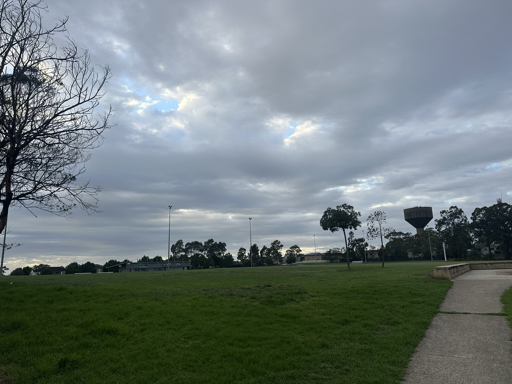

+++
author = "Sathyajith Bhat"
categories = ["Life"]
tags = ["weekly-notes", "gaming", "anavrin", "concerts"]
places = "Sydney"
type = "post"
series = ["Weekly notes"]
url = "/weekly-notes-06-2026/"
title = "Weekly notes 06/2026"
date = 2026-02-08T12:00:00Z
summary = "Week 06 summary - settling in and mowing the lawn"
images = ["/weekly-notes-06-2026/thumb-waite-reserve.jpg"]
+++

_Thumbnail image: Waite Reserve is park in Acacia Gardens that features grounds for cricket and rugby._

### What's been happening

It’s been a couple of weeks since we moved in. It’s been going well. I thought we’d miss the city but surprisingly that hasn’t been the case. I suppose we are still spending half the week in the city. We have a couple of shopping centres nearby and we've been taking the bus to get there. The bus stop is about a 10-minute walk which isn’t too bad. The bus frequency is really what kills it though - generally a bus runs every 30 minutes or an hour, especially on the weekends. That said, we’ve been surprised as how much we’ve been able to move around relying on the public transport.

I had bought a Ryobi 18v lawn mower (R18XLMW2) last week and I got to test it out. I must admit, getting to mow the lawn was a lot harder and involved than I thought it was. Our front and backyard lawns aren’t massive, so I didn’t splurge on an ultra-expensive, self-propelled lawn mower. I got a pretty basic, electric lawn mower. I put the batteries on charge and assembled it. After the batteries were charged, I took it out for a spin. Despite the backyard being relatively flat, it took me a bit of effort to push it through the grass. Maneuvering it was quite hard - this just might be because the grass was overgrown and too thick. In any case, after about twenty minutes of pushing and turning, I managed to get the entire backyard done. 

Here’s some clips on me working with the mower.

<blockquote class="mastodon-embed" data-embed-url="https://mastodon.social/@Sathyabhat/116031064606909220/embed" style="background: #FCF8FF; border-radius: 8px; border: 1px solid #C9C4DA; margin: 0; max-width: 540px; min-width: 270px; overflow: hidden; padding: 0;"> <a href="https://mastodon.social/@Sathyabhat/116031064606909220" target="_blank" style="align-items: center; color: #1C1A25; display: flex; flex-direction: column; font-family: system-ui, -apple-system, BlinkMacSystemFont, 'Segoe UI', Oxygen, Ubuntu, Cantarell, 'Fira Sans', 'Droid Sans', 'Helvetica Neue', Roboto, sans-serif; font-size: 14px; justify-content: center; letter-spacing: 0.25px; line-height: 20px; padding: 24px; text-decoration: none;"> <svg xmlns="http://www.w3.org/2000/svg" xmlns:xlink="http://www.w3.org/1999/xlink" width="32" height="32" viewBox="0 0 79 75"><path d="M63 45.3v-20c0-4.1-1-7.3-3.2-9.7-2.1-2.4-5-3.7-8.5-3.7-4.1 0-7.2 1.6-9.3 4.7l-2 3.3-2-3.3c-2-3.1-5.1-4.7-9.2-4.7-3.5 0-6.4 1.3-8.6 3.7-2.1 2.4-3.1 5.6-3.1 9.7v20h8V25.9c0-4.1 1.7-6.2 5.2-6.2 3.8 0 5.8 2.5 5.8 7.4V37.7H44V27.1c0-4.9 1.9-7.4 5.8-7.4 3.5 0 5.2 2.1 5.2 6.2V45.3h8ZM74.7 16.6c.6 6 .1 15.7.1 17.3 0 .5-.1 4.8-.1 5.3-.7 11.5-8 16-15.6 17.5-.1 0-.2 0-.3 0-4.9 1-10 1.2-14.9 1.4-1.2 0-2.4 0-3.6 0-4.8 0-9.7-.6-14.4-1.7-.1 0-.1 0-.1 0s-.1 0-.1 0 0 .1 0 .1 0 0 0 0c.1 1.6.4 3.1 1 4.5.6 1.7 2.9 5.7 11.4 5.7 5 0 9.9-.6 14.8-1.7 0 0 0 0 0 0 .1 0 .1 0 .1 0 0 .1 0 .1 0 .1.1 0 .1 0 .1.1v5.6s0 .1-.1.1c0 0 0 0 0 .1-1.6 1.1-3.7 1.7-5.6 2.3-.8.3-1.6.5-2.4.7-7.5 1.7-15.4 1.3-22.7-1.2-6.8-2.4-13.8-8.2-15.5-15.2-.9-3.8-1.6-7.6-1.9-11.5-.6-5.8-.6-11.7-.8-17.5C3.9 24.5 4 20 4.9 16 6.7 7.9 14.1 2.2 22.3 1c1.4-.2 4.1-1 16.5-1h.1C51.4 0 56.7.8 58.1 1c8.4 1.2 15.5 7.5 16.6 15.6Z" fill="currentColor"/></svg> 
Post by @Sathyabhat@mastodon.social
 
View on Mastodon
 </a> </blockquote> 

<blockquote class="mastodon-embed" data-embed-url="https://mastodon.social/@Sathyabhat/116032182096893659/embed" style="background: #FCF8FF; border-radius: 8px; border: 1px solid #C9C4DA; margin: 0; max-width: 540px; min-width: 270px; overflow: hidden; padding: 0;"> <a href="https://mastodon.social/@Sathyabhat/116032182096893659" target="_blank" style="align-items: center; color: #1C1A25; display: flex; flex-direction: column; font-family: system-ui, -apple-system, BlinkMacSystemFont, 'Segoe UI', Oxygen, Ubuntu, Cantarell, 'Fira Sans', 'Droid Sans', 'Helvetica Neue', Roboto, sans-serif; font-size: 14px; justify-content: center; letter-spacing: 0.25px; line-height: 20px; padding: 24px; text-decoration: none;"> <svg xmlns="http://www.w3.org/2000/svg" xmlns:xlink="http://www.w3.org/1999/xlink" width="32" height="32" viewBox="0 0 79 75"><path d="M63 45.3v-20c0-4.1-1-7.3-3.2-9.7-2.1-2.4-5-3.7-8.5-3.7-4.1 0-7.2 1.6-9.3 4.7l-2 3.3-2-3.3c-2-3.1-5.1-4.7-9.2-4.7-3.5 0-6.4 1.3-8.6 3.7-2.1 2.4-3.1 5.6-3.1 9.7v20h8V25.9c0-4.1 1.7-6.2 5.2-6.2 3.8 0 5.8 2.5 5.8 7.4V37.7H44V27.1c0-4.9 1.9-7.4 5.8-7.4 3.5 0 5.2 2.1 5.2 6.2V45.3h8ZM74.7 16.6c.6 6 .1 15.7.1 17.3 0 .5-.1 4.8-.1 5.3-.7 11.5-8 16-15.6 17.5-.1 0-.2 0-.3 0-4.9 1-10 1.2-14.9 1.4-1.2 0-2.4 0-3.6 0-4.8 0-9.7-.6-14.4-1.7-.1 0-.1 0-.1 0s-.1 0-.1 0 0 .1 0 .1 0 0 0 0c.1 1.6.4 3.1 1 4.5.6 1.7 2.9 5.7 11.4 5.7 5 0 9.9-.6 14.8-1.7 0 0 0 0 0 0 .1 0 .1 0 .1 0 0 .1 0 .1 0 .1.1 0 .1 0 .1.1v5.6s0 .1-.1.1c0 0 0 0 0 .1-1.6 1.1-3.7 1.7-5.6 2.3-.8.3-1.6.5-2.4.7-7.5 1.7-15.4 1.3-22.7-1.2-6.8-2.4-13.8-8.2-15.5-15.2-.9-3.8-1.6-7.6-1.9-11.5-.6-5.8-.6-11.7-.8-17.5C3.9 24.5 4 20 4.9 16 6.7 7.9 14.1 2.2 22.3 1c1.4-.2 4.1-1 16.5-1h.1C51.4 0 56.7.8 58.1 1c8.4 1.2 15.5 7.5 16.6 15.6Z" fill="currentColor"/></svg> 
Post by @Sathyabhat@mastodon.social
 
View on Mastodon
 </a> </blockquote> 



I must admit, it came out pretty decent. Not bad for a first timer. I still don’t have a line trimmer, so the grass is a bit overgrown at the edge but that’s for some other time.

Our office commute was pretty ok. We’re still sticking to our gym and making it work - we’re doing PT 2x a week, on Tuesdays and Wednesdays. The return from the gym is a bit of a long commute but so far it’s been okay. There are multiple ways to return from the gym - the metro station is quite close, so we can take the metro to Rouse Hill/Bella Vista and then take the bus home. The other option is to take two express buses (switching at about half the distance). Jo wanted to know which was the faster option, so we decided to do a race - Grand Tour/Top Gear style. On Tuesday after our gym, we decided to do this race. Jo would take the metro and then the bus while I would take the two-express bus route. On paper, Jo had the advantage - the metro runs a lot faster and runs at higher frequency - but the local bus from the metro station to home is a lot slower. 

For me, the express bus, while not going as fast as the metro, still runs a lot faster compared to the other buses, but runs at a lesser frequency. In fact, I had just missed the bus and had to wait 10 minutes for the next bus from the gym. At about halfway through the journey, I’d have to get down and switch to the other express bus, which was another 10-minute wait.  Despite these setbacks, I was actually surprised that I managed to reach about a minute or two after Jo reached - Jo told me her bus didn’t have too many people so it could skip a lot of the stops - something that couldn’t be said for me. All in all, it was a fun little challenge! 

I’m also happy that [Pooja’s](https://www.matratype.com/) book, “India Street Lettering” was delivered to my house in good condition. I look forward to reading it! 



It was also concert week - we had two concerts on back-to-back days. First was Victor Wooten with the Wooten Brothers. We had seen Victor Wooten and the Wooten Brothers [three years ago and loved it](/2023/06/04/weekly-notes-22-2023/), so we weren’t going to miss this one. We also got a chance to be all the way right up near the stage, so it was even better. The support artist was Jaron Jay - really cool funk/soul singer/guitarist with his band, and he was good as well. The Wooten Brothers were fabulous and had an all-new setlist. We enjoyed the concert.

{{< fbgallery "https://i.sathyabh.at/sb/weekly-notes" "Victor Wooten and The Wooten Brothers" "victor-wooten-the-wooten-brothers-260208-1.jpg" "victor-wooten-the-wooten-brothers-260208-2.jpg" "victor-wooten-the-wooten-brothers-260208-3.jpg" "victor-wooten-the-wooten-brothers-260208-4.jpg" "victor-wooten-the-wooten-brothers-260208-5.jpg" "victor-wooten-the-wooten-brothers-260208-6.jpg" "victor-wooten-the-wooten-brothers-260208-7.jpg" "victor-wooten-the-wooten-brothers-260208-8.jpg" "victor-wooten-the-wooten-brothers-260208-9.jpg" >}}

And right the next day was OneRepublic’s concert. We also had a really good time - especially singing along to some of their popular songs like [Apologize](https://www.youtube.com/watch?v=ZSM3w1v-A_Y) and [Counting Stars](https://www.youtube.com/watch?v=hT_nvWreIhg). OneRepublic’s concert was in Qudos Bank Arena which meant we got to meet and have a quick dinner and chat with [Balu & his wife AK](https://balanarayan.com/) just before the concert. Both Balu & I remarked that the area seemed oddly less crowded than what we’d usually expect - but the Qudos Bank Arena was packed to capacity with no seats. Returning back was a long commute via a couple of train rides followed by Uber home, but nothing too stressing. All in all, that was a good evening. 



For the weekend, we just stayed at home with a blazing hot Saturday and an absolutely cloudy and rainy Sunday - but we did manage to get our weekly grocery shopping done, along with a quick Kmart/Big W stop over to get some more things for the house. 

Meta: I've been a big fan of blogrolls since my first blog which was on WordPress. Since moving to Hugo, that section had been missing for a while. I finally got around to adding it back in this week. You can find it in the sidebar on the right on desktop - mobile view might be weird. I’ve added a few blogs that I read regularly, and I’ll be adding more to it over time. If you have a blog that you think I should add to the blogroll, please let me know! I used [Thej's blogring project](https://thejeshgn.com/projects/blogring/) for inspiration, with [claude](https://code.claude.com/docs/en/overview) doing the bulk of the hard work and I think it looks pretty good.

### What I've been playing

Now that things are set, I have been playing Path of Exile 2 again - this time created a new Druid-class character. I’m aiming for a plant druid build which seems pretty chill. SO far, it’s pretty strong, letting me power through even Jamanra, the act two boss that I usually struggle with. Of course, having some extra currency and gems mean that I can overgear my character to make it a lot easier as well.



### What we ate

[Thai Splendid, Rouse Hill](https://maps.app.goo.gl/D4u2GrCeNhrJJ29D7) - we stopped by here for dinner. It’s a small little well lit restaurant focusing on Thai cuisine. We ordered the mixed entree which came with Satay skewer, spring roll, curry puff and fish cake and crispy pork belly chilli jam for mains. The food was pretty ok, nothing great. The fish cake was average. Jo & I shared the satay which was not too bad. The crispy pork belly wasn’t that crispy and was deep fried. So yeah not the best, probably will explore other places as we get more familiar with the area.



[Mixtape Brewing & Bar, Marrickville](https://maps.app.goo.gl/kLtyFK2kRqjPkk8U8) - A cool little microbrewery & live gig venue with a small restaurant attached. We stopped by here for dinner prior to the Victor Wooten concert. We both ordered their IPA/XPAs for drinks and for food we ordered the Jalapeno bites and the chicken nachos and buffalo cauliflowers. The food was really good, and the beers hit the spot as well. 



### Music of the Week

YouTube popped up this [cool live-album concert “The Dance”](https://www.youtube.com/watch?v=9suHkG7QfYw) by Fleetwood Mac - such a great performance. Loved it.



### Link of the week

YouTuber saveitforparts tries to receive data from the Defense Meteorological Satellite Program (DMSP). Amazing video that shows his patience and resilience in trying to get what he wants. Worth a sub!



### Thanks for reading.
Thanks for reading and have a great week ahead.

Subscribe to my weekly notes:
- [Email newsletter](https://sathyabhat.substack.com/)
- [RSS feed for the weekly notes](https://sathyabh.at/series/weekly-notes/index.xml)
- [RSS feed for my site](https://sathyabh.at/index.xml)
